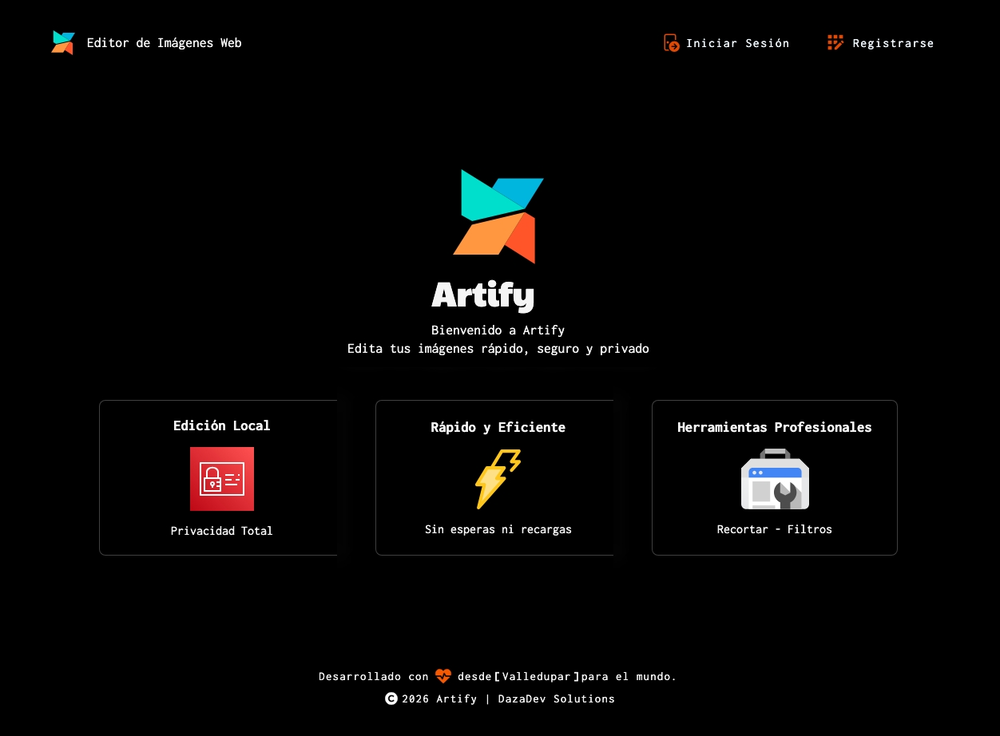

# Artify — Editor de Imágenes Web

<div align="center">


Aplicación web para editar imágenes desde el navegador, administrar usuarios y registrar la actividad de edición con PostgreSQL.

[Ver aplicación](https://tecno85.github.io/artify/) · [Instalación local](./docs/tecnica/plan-instalacion-artify.md) · [Despliegue](./docs/tecnica/despliegue.md) · [Documentación](#documentación)

</div>

---



## Descripción

Artify permite cargar, transformar y descargar imágenes mediante una interfaz web. El proyecto combina un frontend desarrollado con HTML, CSS y JavaScript Vanilla, una API REST con Node.js y Express, y una base de datos PostgreSQL.

La aplicación incluye autenticación por roles, persistencia de preferencias y operaciones, panel administrativo y un editor basado en Canvas API.

## Características principales

- Carga de imágenes mediante selector de archivos o arrastrar y soltar.
- Recorte libre o con proporciones predefinidas.
- Redimensionamiento y rotación.
- Filtros de blanco y negro, sepia, brillo y contraste con vista previa y confirmación.
- Conversión a PNG, JPEG y WebP con ajuste de calidad.
- Historial de hasta 20 pasos para deshacer y rehacer.
- Zoom entre 50 % y 200 %.
- Registro, inicio de sesión y autorización por roles.
- Panel administrativo con gestión de usuarios y analíticas.
- Persistencia de configuraciones, sesiones y operaciones en PostgreSQL.

## Tecnologías

| Área | Tecnologías |
| --- | --- |
| Frontend | HTML5, CSS3, JavaScript Vanilla, Canvas API |
| Backend | Node.js 22.13+, Express 5 |
| Base de datos | PostgreSQL 15+, `pg` |
| Seguridad | JWT, bcrypt, CORS, variables de entorno |
| Pruebas | Node Test Runner, Supertest, PostgreSQL |
| Despliegue | GitHub Pages, Render, Neon, GitHub Actions |

## Arquitectura

```text
┌──────────────────────────────────────┐
│ Frontend                             │
│ HTML + CSS + JavaScript + Canvas API │
└──────────────────┬───────────────────┘
                   │ API REST / HTTPS
┌──────────────────▼───────────────────┐
│ Backend                              │
│ Node.js + Express                    │
│ Rutas · Controladores · Middlewares  │
└──────────────────┬───────────────────┘
                   │ pg
┌──────────────────▼───────────────────┐
│ PostgreSQL                           │
│ Usuarios · Sesiones · Operaciones    │
│ Configuraciones · Imágenes           │
└──────────────────────────────────────┘
```

La explicación completa se encuentra en la [documentación de arquitectura](./docs/tecnica/arquitectura.md).

## Estructura del repositorio

```text
artify/
├── frontend/              # Interfaz y editor de imágenes
├── backend/               # API, autenticación y pruebas
├── database/postgresql/   # Esquema, datos iniciales y consultas
├── docs/                  # Documentación técnica y académica
├── scripts/               # Automatización de configuración
└── .github/workflows/     # Pruebas y despliegue continuo
```

## Inicio rápido

### Requisitos

- Node.js 22.13 o superior.
- pnpm 11.1.1.
- PostgreSQL 15 o superior.
- Git y un navegador moderno.

### Preparación

```bash
git clone https://github.com/Tecno85/artify.git
cd artify
cp .env.example backend/.env
cd backend
pnpm install
```

Antes de iniciar la aplicación se debe crear `artify_db`, cargar el esquema PostgreSQL y completar las credenciales locales en `backend/.env`.

El procedimiento paso a paso para Windows y macOS está en el [plan de instalación local](./docs/tecnica/plan-instalacion-artify.md).

### Ejecución

En una terminal:

```bash
cd backend
pnpm start
```

En otra terminal, desde la raíz del proyecto:

```bash
npx http-server@14.1.1 frontend -p 8080 -c-1
```

Después se abre [http://127.0.0.1:8080](http://127.0.0.1:8080). El backend utiliza el puerto `3000` y el frontend el `8080`.

## Pruebas

Validación de sintaxis del backend:

```bash
cd backend
pnpm run check
```

Pruebas de integración:

```bash
cd backend
pnpm test
```

> [!WARNING]
> Las pruebas crean, actualizan y eliminan registros. Deben ejecutarse únicamente contra una base PostgreSQL local o exclusiva para pruebas, nunca contra Neon ni una base de producción.

GitHub Actions ejecuta automáticamente la validación y las 18 pruebas del backend en cada `push` a `main` y en los pull requests.

## Despliegue

| Componente | Plataforma | Dirección |
| --- | --- | --- |
| Frontend | GitHub Pages | [tecno85.github.io/artify](https://tecno85.github.io/artify/) |
| Backend | Render | `https://artify-sena-postgresql.onrender.com` |
| Base de datos | Neon | PostgreSQL administrado |

Cada `push` a `main` publica el contenido de `frontend/` mediante GitHub Actions. La configuración completa de variables, CORS, Render, Neon y GitHub Pages está en la [guía de despliegue](./docs/tecnica/despliegue.md).

## Documentación

### Para comenzar

- [Plan de instalación local](./docs/tecnica/plan-instalacion-artify.md)
- [Guía de despliegue público](./docs/tecnica/despliegue.md)
- [Descripción del proyecto](./docs/proyecto/descripcion-proyecto.md)
- [Requerimientos funcionales](./docs/proyecto/requerimientos-funcionales.md)

### Desarrollo y operación

- [Arquitectura técnica](./docs/tecnica/arquitectura.md)
- [Base de datos](./docs/tecnica/base-datos.md)
- [API de analíticas](./docs/tecnica/api-analytics.md)
- [Pruebas de autenticación](./docs/tecnica/plan-pruebas-autenticacion.md)
- [Estándares de codificación](./docs/tecnica/coding-standards.md)
- [Mantenimiento y soporte](./docs/tecnica/plan-mantenimiento-soporte-artify.md)

### Documentación académica

- [Hardware, software y redes](./docs/proyecto/hardware-software-redes.md)
- [Configuración de servicios](./docs/tecnica/configuracion-servicios-artify.md)
- [Migración a PostgreSQL](./docs/tecnica/plan-migracion-postgresql.md)
- [Respaldo de datos e ISO 27001](./docs/tecnica/plan-respaldo-datos-iso27001-artify.md)
- [Verificación de hardware](./docs/tecnica/verificacion-hardware-artify.md)
- [Alta disponibilidad y clústeres](./docs/tecnica/alta-disponibilidad-clusteres.md)

## Estado del proyecto

Artify se encuentra activo y utiliza PostgreSQL como motor oficial de persistencia. El frontend, el backend, las pruebas y el despliegue están integrados en el repositorio principal.

Entre las mejoras futuras se consideran ampliar las pruebas del frontend, incorporar más herramientas de edición y agregar paginación al historial de operaciones.

## Autor

**Ivan Dario Madrid Daza**<br>
Análisis y Desarrollo de Software — SENA<br>
GitHub: [@Tecno85](https://github.com/Tecno85)

## Licencia

Este proyecto se distribuye bajo la [Licencia MIT](./LICENSE).

---

<div align="center">

Desarrollado con HTML, CSS, JavaScript, Node.js y PostgreSQL.

[Volver arriba](#artify--editor-de-imágenes-web)

</div>
