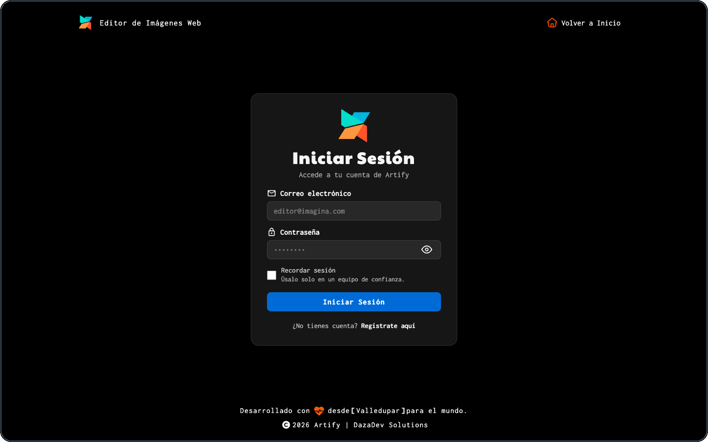
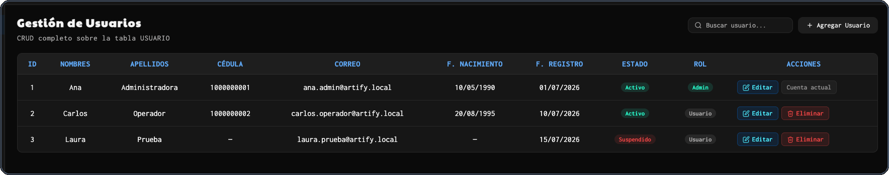
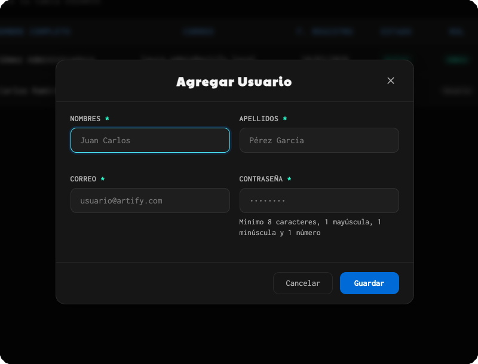
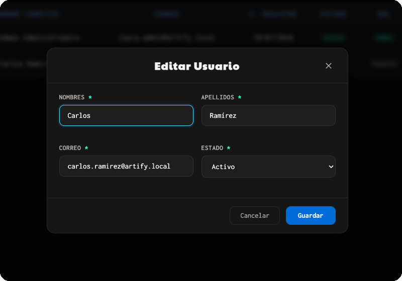
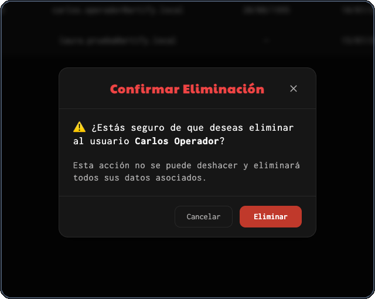

# Guía del Usuario Administrador de Artify

## Evidencia GA10-220501097-AA11-EV01

**Elabora el manual de usuario de acuerdo con las funcionalidades del software**

Iván Darío Madrid Daza<br>
Análisis y Desarrollo de Software<br>
Servicio Nacional de Aprendizaje (SENA)<br>
Instructor: José Ignacio Botero Osorio<br>
Julio de 2026

---

## Control del documento

| Elemento | Descripción |
| --- | --- |
| Documento | Guía del usuario administrador de Artify |
| Versión | 1.0 |
| Fecha | Julio de 2026 |
| Autor | Iván Darío Madrid Daza |
| Rol destinatario | Usuario administrador |
| Aplicación | Artify |

## Tabla de contenido

1. [Introducción](#1-introducción)
2. [Objetivos](#2-objetivos)
3. [Alcance](#3-alcance)
4. [Descripción del rol](#4-descripción-del-rol)
5. [Requisitos y responsabilidades](#5-requisitos-y-responsabilidades)
6. [Ingreso administrativo](#6-ingreso-administrativo)
7. [Componentes del panel](#7-componentes-del-panel)
8. [Gestión de usuarios](#8-gestión-de-usuarios)
9. [Flujo de trabajo recomendado](#9-flujo-de-trabajo-recomendado)
10. [Mensajes y solución de problemas](#10-mensajes-y-solución-de-problemas)
11. [Recomendaciones de seguridad](#11-recomendaciones-de-seguridad)
12. [Preguntas frecuentes](#12-preguntas-frecuentes)
13. [Glosario](#13-glosario)
14. [Referencias](#14-referencias)

## 1. Introducción

Artify incorpora un panel protegido para administrar las cuentas registradas. Esta guía presenta las funciones disponibles para el usuario administrador, identificado internamente con el rol `admin`. Las instrucciones corresponden al comportamiento implementado en julio de 2026.

El documento explica el acceso al panel, la consulta y búsqueda de usuarios, la creación de cuentas operativas, la actualización de datos y estados, la eliminación controlada y el cierre de sesión. Debido al impacto de estas acciones, también establece responsabilidades y precauciones de seguridad.

## 2. Objetivos

### 2.1 Objetivo general

Orientar al administrador en la gestión segura, coherente y verificable de las cuentas de usuario de Artify.

### 2.2 Objetivos específicos

- Explicar el ingreso y la redirección por rol.
- Identificar los componentes y datos del panel administrativo.
- Describir la consulta, búsqueda, creación, edición y eliminación de usuarios.
- Diferenciar los estados de cuenta y sus consecuencias.
- Prevenir cambios accidentales o accesos administrativos indebidos.

## 3. Alcance

Esta guía cubre exclusivamente la interfaz administrativa de gestión de usuarios. Incluye las operaciones de listar, buscar, crear, editar, cambiar estado y eliminar cuentas.

No cubre la instalación técnica, la administración directa de PostgreSQL, la modificación de roles, el editor de imágenes ni las analíticas disponibles mediante API. El panel actual no muestra un módulo visual de analíticas ni permite asignar el rol `admin` desde el formulario. Estas limitaciones evitan documentar como disponible una función que no existe en la interfaz.

## 4. Descripción del rol

El usuario administrador es una cuenta activa cuyo rol ha sido establecido como `admin` por el responsable técnico. Puede:

- Acceder al panel administrativo mediante el inicio de sesión general.
- Consultar la lista y los indicadores de usuarios.
- Buscar cuentas por nombre, apellido o correo.
- Crear nuevas cuentas operativas.
- Editar los datos básicos y el estado de una cuenta.
- Eliminar cuentas diferentes de la propia.
- Cerrar la sesión administrativa.

La autorización no depende solamente de que la página sea visible. El backend comprueba el token, el estado actual de la cuenta y el rol antes de permitir las operaciones protegidas.

## 5. Requisitos y responsabilidades

### 5.1 Requisitos de acceso

- Navegador web moderno con JavaScript habilitado.
- Conexión al frontend, backend y base de datos de Artify.
- Cuenta activa con rol `admin`.
- Correo y contraseña válidos.
- Autorización institucional para gestionar datos de usuarios.

### 5.2 Responsabilidades

- Consultar y modificar solamente la información necesaria.
- Confirmar la identidad del usuario antes de cambiar su estado.
- Evitar cuentas duplicadas por correo.
- No compartir la sesión ni las credenciales administrativas.
- Verificar cuidadosamente una eliminación, ya que también afecta datos dependientes.
- Cerrar sesión al terminar.

## 6. Ingreso administrativo

Artify no utiliza una página de acceso exclusiva para administradores. Todos los usuarios ingresan desde el mismo formulario y el sistema decide el destino según el rol.

1. Abra la página de inicio de sesión.
2. Escriba el correo de la cuenta administrativa.
3. Ingrese la contraseña.
4. Active **Recordar sesión** solo en un equipo personal y protegido.
5. Seleccione **Iniciar Sesión**.
6. Espere la validación del estado y del rol.
7. Artify abrirá automáticamente el panel de administración.

**Figura 1**<br>
*Acceso general utilizado por el administrador*

<p align="center">
  
</p>

*Nota.* Captura de elaboración propia. Las credenciales no se muestran por seguridad.

Si la cuenta está inactiva o suspendida, las credenciales son incorrectas o el rol ya no es administrativo, el sistema rechazará el acceso. Un cambio posterior del estado o del rol también invalida las operaciones de un token emitido anteriormente.

## 7. Componentes del panel

**Figura 2**<br>
*Panel de gestión de usuarios*

<p align="center">
  
</p>

*Nota.* Captura de elaboración propia con identidades y datos completamente ficticios. No representa registros de producción.

| Zona | Elemento | Función |
| --- | --- | --- |
| Encabezado | Identidad administrativa | Muestra el nombre de la cuenta autenticada. |
| Encabezado | Cerrar Sesión | Elimina las credenciales locales y sale del panel. |
| Barra lateral | Usuarios | Indica el total de registros mostrados por el módulo. |
| Barra lateral | Activos e inactivos | Resume cuentas activas y cuentas con estado diferente de activo. |
| Barra de herramientas | Buscar usuario | Filtra el listado en tiempo real. |
| Barra de herramientas | Agregar Usuario | Abre el formulario de creación. |
| Tabla | Datos del usuario | Presenta ID, nombre completo, correo, fecha de registro, estado y rol. |
| Tabla | Acciones | Permite editar o eliminar cuando la protección de la cuenta lo admite. |

### 7.1 Interpretar los estados

| Estado | Significado operativo |
| --- | --- |
| Activo | La cuenta puede iniciar sesión si sus credenciales son válidas. |
| Inactivo | La cuenta permanece registrada, pero no puede iniciar sesión. |
| Suspendido | El acceso está bloqueado hasta que un administrador reactive la cuenta. |

El indicador **Inactivos** agrupa todas las cuentas cuyo estado no es `activo`; por eso incluye tanto inactivas como suspendidas.

## 8. Gestión de usuarios

### 8.1 Consultar el listado

1. Inicie sesión con la cuenta administrativa.
2. Espere la carga de la tabla.
3. Revise el total de usuarios y los indicadores de estado.
4. Use el desplazamiento vertical cuando el listado tenga muchos registros.
5. Compruebe los datos antes de seleccionar una acción.

Si aparece **Cargando usuarios...** de forma prolongada o una notificación de error, compruebe la conexión con el backend antes de realizar cambios.

### 8.2 Buscar un usuario

1. Seleccione el campo **Buscar usuario...**.
2. Escriba parte del nombre, apellido o correo.
3. Observe cómo la tabla se filtra mientras escribe.
4. Borre el contenido del campo para recuperar el listado completo.

La búsqueda actúa sobre los usuarios ya cargados en el panel y no modifica ningún registro.

### 8.3 Crear una cuenta operativa

1. Seleccione **Agregar Usuario**.
2. Escriba nombres y apellidos de al menos dos caracteres válidos.
3. Escriba un correo válido y no registrado.
4. Defina una contraseña de mínimo 8 caracteres con al menos una mayúscula, una minúscula y un número.
5. Seleccione **Guardar**.
6. Espere el mensaje de confirmación y verifique el nuevo registro en la tabla.

**Figura 3**<br>
*Formulario para agregar un usuario*

<p align="center">
  
</p>

*Nota.* Captura de elaboración propia. El formulario se presenta vacío para evitar divulgar datos personales.

Los campos marcados con asterisco son obligatorios. El panel crea una cuenta operativa; no ofrece un selector de rol y no debe utilizarse para promover administradores.

### 8.4 Editar datos y estado

1. Localice el registro mediante la tabla o la búsqueda.
2. Seleccione **Editar** en su fila.
3. Modifique nombres, apellidos o correo según sea necesario.
4. Seleccione el estado **Activo**, **Inactivo** o **Suspendido**.
5. Revise la información completa.
6. Seleccione **Guardar**.
7. Confirme que la tabla muestre los cambios.

**Figura 4**<br>
*Edición de datos y estado de una cuenta*

<p align="center">
  
</p>

*Nota.* Captura de elaboración propia con una identidad ficticia.

La edición no solicita una contraseña nueva y tampoco modifica el rol. Para proteger la continuidad administrativa, el estado de la propia cuenta autenticada aparece bloqueado y no puede cambiarse desde este formulario.

### 8.5 Eliminar una cuenta

1. Localice el registro correcto.
2. Verifique nombre y correo antes de continuar.
3. Seleccione **Eliminar**.
4. Lea el nombre presentado en el cuadro de confirmación.
5. Seleccione **Cancelar** si existe cualquier duda.
6. Seleccione **Eliminar** solamente cuando la decisión esté confirmada.
7. Compruebe que la cuenta desaparezca del listado y que los indicadores se actualicen.

**Figura 5**<br>
*Confirmación de eliminación de una cuenta*

<p align="center">
  
</p>

*Nota.* Captura de elaboración propia con datos ficticios. Durante la elaboración de esta evidencia no se ejecutó la eliminación.

> [!WARNING]
> La eliminación no se puede deshacer desde el panel y también elimina los datos dependientes del usuario. La cuenta administrativa actualmente autenticada está protegida: su botón muestra **Cuenta actual** y no permite eliminarla.

### 8.6 Cerrar sesión

1. Termine y verifique cualquier gestión pendiente.
2. Seleccione **Cerrar Sesión** en el encabezado.
3. Espere el retorno a la página de inicio.
4. Si utilizó un equipo compartido, cierre también la ventana del navegador.

## 9. Flujo de trabajo recomendado

```text
          Inicio de sesión administrativo
                        ↓
          Consulta de lista e indicadores
                        ↓
               Búsqueda del registro
                        ↓
        Verificación de identidad y necesidad
                        ↓
      Crear, editar, cambiar estado o eliminar
                        ↓
        Comprobar mensaje, tabla e indicadores
                        ↓
                  Cerrar sesión
```

Para una restricción temporal, es preferible cambiar el estado a **Suspendido** o **Inactivo**. La eliminación se reserva para casos confirmados donde también deban desaparecer los datos asociados.

## 10. Mensajes y solución de problemas

| Situación | Causa probable | Acción recomendada |
| --- | --- | --- |
| Acceso denegado | La cuenta no es `admin`, está restringida o el token venció | Vuelva a iniciar sesión y solicite revisión técnica si persiste. |
| Error al cargar usuarios | Backend o base de datos no disponibles | Verifique conectividad y disponibilidad antes de operar. |
| No se encontraron usuarios | El filtro no coincide con los datos | Borre o modifique el texto de búsqueda. |
| Correo duplicado | Ya existe una cuenta con el mismo correo | Busque la cuenta existente y corrija el dato. |
| Contraseña rechazada al crear | No cumple la política | Use mínimo 8 caracteres, una mayúscula, una minúscula y un número. |
| Estado deshabilitado al editar | Es la propia cuenta administrativa | La protección evita perder el acceso accidentalmente. |
| Eliminar deshabilitado | Es la cuenta actualmente autenticada | Gestione la cuenta desde un procedimiento técnico autorizado si fuera indispensable. |
| Cambios no reflejados | La solicitud falló o el listado no se actualizó | Lea la notificación, recargue y verifique antes de repetir. |

## 11. Recomendaciones de seguridad

- Use una cuenta administrativa individual y una contraseña exclusiva.
- No habilite **Recordar sesión** en equipos compartidos.
- No comparta capturas con nombres o correos reales sin autorización.
- Prefiera suspender temporalmente antes de eliminar cuando la decisión no sea definitiva.
- Verifique al menos dos datos de identidad antes de editar o eliminar.
- No intente cambiar roles mediante herramientas del navegador o solicitudes manuales.
- Cierre sesión al finalizar y reporte accesos o cambios inesperados.

## 12. Preguntas frecuentes

### ¿Cómo se crea un nuevo administrador?

El panel no permite asignar roles. Una cuenta se registra primero y el responsable técnico autorizado realiza la promoción mediante el procedimiento administrativo de base de datos definido por el proyecto.

### ¿Puedo cambiar la contraseña de un usuario existente?

No desde la interfaz actual. La contraseña se establece durante la creación de la cuenta y no aparece en el formulario de edición.

### ¿Por qué no puedo suspender mi propia cuenta?

Artify bloquea el selector de estado de la cuenta autenticada para evitar que el administrador pierda accidentalmente el acceso al panel.

### ¿Qué diferencia existe entre suspender y eliminar?

Suspender conserva el registro y bloquea el ingreso. Eliminar borra la cuenta y sus datos dependientes, por lo cual es una acción definitiva desde la interfaz.

### ¿Dónde están las analíticas?

El backend expone una API de analíticas, pero el panel administrativo actual no incorpora una pantalla para consultarlas. Por esa razón no forman parte de los procedimientos de esta guía.

## 13. Glosario

| Término | Definición |
| --- | --- |
| Administrador | Cuenta con rol `admin` autorizada para gestionar usuarios. |
| CRUD | Operaciones de crear, consultar, actualizar y eliminar registros. |
| Estado | Condición de una cuenta: activo, inactivo o suspendido. |
| Rol | Nivel de autorización asignado a una cuenta. |
| Token | Credencial temporal utilizada para autenticar las solicitudes protegidas. |
| Usuario operativo | Cuenta con rol `usuario` que accede al editor. |

## 14. Referencias

Madrid Daza, I. D. (2026). *Artify: Editor de imágenes web* [Software]. GitHub. https://github.com/Tecno85/artify

Servicio Nacional de Aprendizaje. (2026). *GA10-220501097-AA11: Elaborar el manual de usuario* [Guía de aprendizaje]. SENA.

---

Esta guía forma, junto con la **Guía del usuario operativo de Artify**, el manual de usuario solicitado para la evidencia GA10-220501097-AA11-EV01.
