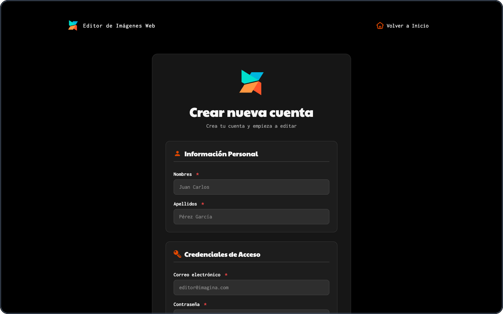
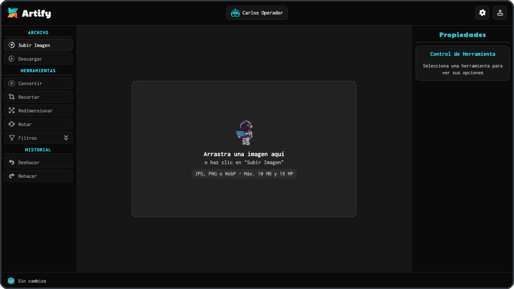
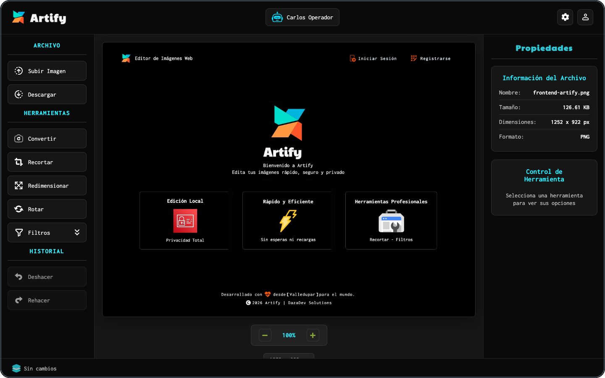
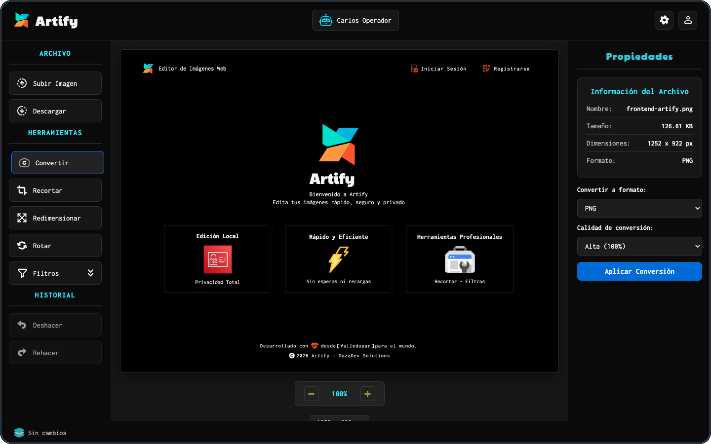
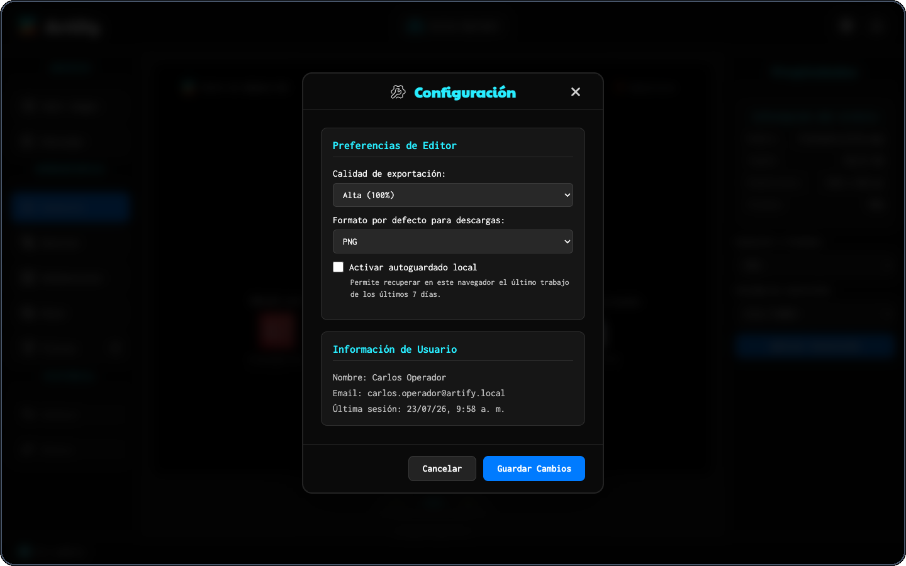

# Guía del Usuario Operativo de Artify

## Evidencia GA10-220501097-AA11-EV01

**Elabora el manual de usuario de acuerdo con las funcionalidades del software**

Iván Darío Madrid Daza<br>
Análisis y Desarrollo de Software<br>
Servicio Nacional de Aprendizaje (SENA)<br>
Instructor: José Ignacio Botero Osorio<br>
Julio de 2026

---

## Control del documento

| Elemento | Descripción |
| --- | --- |
| Documento | Guía del usuario operativo de Artify |
| Versión | 1.0 |
| Fecha | Julio de 2026 |
| Autor | Iván Darío Madrid Daza |
| Rol destinatario | Usuario operativo |
| Aplicación | Artify |

## Tabla de contenido

1. [Introducción](#1-introducción)
2. [Objetivos](#2-objetivos)
3. [Alcance](#3-alcance)
4. [Descripción del rol](#4-descripción-del-rol)
5. [Requisitos de uso](#5-requisitos-de-uso)
6. [Registro e ingreso](#6-registro-e-ingreso)
7. [Componentes del editor](#7-componentes-del-editor)
8. [Procedimientos de edición](#8-procedimientos-de-edición)
9. [Configuración, perfil y sesión](#9-configuración-perfil-y-sesión)
10. [Flujo de trabajo recomendado](#10-flujo-de-trabajo-recomendado)
11. [Mensajes y solución de problemas](#11-mensajes-y-solución-de-problemas)
12. [Recomendaciones de seguridad](#12-recomendaciones-de-seguridad)
13. [Preguntas frecuentes](#13-preguntas-frecuentes)
14. [Glosario](#14-glosario)
15. [Referencias](#15-referencias)

## 1. Introducción

Artify es una aplicación web que permite cargar, transformar y descargar imágenes desde un navegador. Esta guía explica el uso del sistema para el usuario operativo, denominado `usuario` dentro de la aplicación. Las instrucciones corresponden a las funciones implementadas en julio de 2026.

La guía presenta el registro, el inicio de sesión, los componentes del editor y los procedimientos necesarios para recortar, redimensionar, rotar, filtrar, convertir y descargar una imagen. También explica el historial, el zoom, las preferencias, el autoguardado, el perfil y el cierre seguro de la sesión.

## 2. Objetivos

### 2.1 Objetivo general

Orientar al usuario operativo en el uso correcto y seguro de las funciones de edición de imágenes disponibles en Artify.

### 2.2 Objetivos específicos

- Explicar el registro y el inicio de sesión.
- Identificar las partes principales del editor.
- Describir paso a paso las herramientas de edición.
- Orientar la configuración, consulta del perfil y recuperación local del trabajo.
- Presentar soluciones para situaciones frecuentes durante la operación.

## 3. Alcance

Esta guía cubre las funciones visibles para una cuenta con rol operativo: autenticación, carga, edición, conversión y descarga de imágenes, configuración personal, estadísticas del perfil y cierre de sesión.

No incluye la instalación del sistema, la configuración del servidor o de PostgreSQL, la administración de cuentas, la recuperación de contraseñas por correo ni funciones de inteligencia artificial. Esos elementos no pertenecen al rol operativo o no forman parte del alcance implementado.

## 4. Descripción del rol

El usuario operativo es la persona registrada que accede al editor para trabajar con sus imágenes. Puede:

- Consultar y guardar sus preferencias.
- Cargar una imagen compatible desde su equipo.
- Aplicar transformaciones y filtros.
- Deshacer o rehacer cambios dentro del historial disponible.
- Descargar el resultado en un formato admitido.
- Consultar estadísticas básicas de su actividad.
- Cerrar su sesión.

El usuario operativo no puede entrar al panel administrativo ni consultar, crear, editar o eliminar cuentas de otras personas.

## 5. Requisitos de uso

### 5.1 Requisitos mínimos

- Navegador web moderno con JavaScript habilitado.
- Conexión al frontend y al servicio de Artify.
- Ventana con un área útil recomendada de al menos 1024 x 600 píxeles.
- Cuenta activa con rol operativo.
- Imagen JPG, PNG o WebP.

### 5.2 Límites de las imágenes

| Condición | Límite |
| --- | --- |
| Tamaño del archivo | Máximo 10 MB |
| Resolución total | Máximo 16 megapíxeles |
| Longitud de cada lado | Máximo 8192 píxeles |
| Formatos de entrada | JPG, PNG y WebP |
| Formatos de salida | PNG, JPEG y WebP |

> [!IMPORTANT]
> La edición se procesa en el navegador. Una imagen grande puede requerir más memoria y tardar más en aplicar filtros o transformaciones.

## 6. Registro e ingreso

### 6.1 Crear una cuenta operativa

1. Abra Artify y seleccione la opción para registrarse.
2. Escriba sus nombres y apellidos.
3. Ingrese un correo electrónico válido que no esté registrado.
4. Cree una contraseña de 8 a 128 caracteres con al menos una mayúscula, una minúscula y un número.
5. Repita exactamente la contraseña.
6. Lea y acepte los términos y condiciones.
7. Seleccione **Registrarse**.
8. Espere la confirmación. Cuando el registro termine correctamente, Artify iniciará una sesión temporal y abrirá el editor.

**Figura 1**<br>
*Formulario de registro del usuario operativo*

<p align="center">
  
</p>

*Nota.* Captura de elaboración propia tomada del frontend local de Artify. Los campos no contienen datos personales reales.

### 6.2 Iniciar sesión

1. Abra la página de inicio de sesión.
2. Ingrese el correo asociado a su cuenta.
3. Escriba la contraseña.
4. Active **Recordar sesión** solo si utiliza un equipo personal y confiable.
5. Seleccione **Iniciar Sesión**.
6. El sistema validará las credenciales y lo dirigirá al editor.

**Figura 2**<br>
*Acceso general de Artify*

<p align="center">
  
</p>

*Nota.* Captura de elaboración propia. El mismo acceso identifica el rol y dirige al usuario operativo al editor.

La casilla **Recordar sesión** conserva el acceso en el navegador después de cerrar la pestaña. Si no se activa, la sesión permanece en el almacenamiento temporal de la pestaña o ventana.

> [!NOTE]
> Las cuentas inactivas o suspendidas no pueden iniciar sesión. Artify tampoco incluye actualmente recuperación de contraseña por correo; en ese caso se debe contactar al responsable administrativo.

## 7. Componentes del editor

**Figura 3**<br>
*Editor antes de cargar una imagen*

<p align="center">
  
</p>

*Nota.* Captura de elaboración propia con una identidad ficticia.

| Zona | Componentes | Función |
| --- | --- | --- |
| Encabezado | Nombre, configuración y perfil | Identifica la cuenta y abre las opciones personales. |
| Archivo | Subir imagen y descargar | Permite ingresar el archivo y obtener el resultado. |
| Herramientas | Convertir, recortar, redimensionar, rotar y filtros | Contiene las operaciones principales. |
| Historial | Deshacer y rehacer | Recorre los estados guardados de la edición. |
| Área central | Zona de carga, lienzo y zoom | Muestra y permite manipular la imagen. |
| Propiedades | Datos del archivo y controles | Presenta nombre, tamaño, dimensiones, formato y opciones de la herramienta activa. |
| Barra inferior | Contador y transformación | Informa el estado de los cambios aplicados. |

Al entrar al editor, las herramientas que necesitan una imagen aparecen deshabilitadas. Se activan después de una carga válida.

## 8. Procedimientos de edición

### 8.1 Cargar y consultar una imagen

1. Seleccione **Subir Imagen** y elija un archivo compatible; como alternativa, arrástrelo hasta el área central.
2. Espere a que Artify muestre la imagen.
3. Compruebe en **Propiedades** el nombre, tamaño, dimensiones y formato.
4. Verifique que se habiliten las herramientas y el botón **Descargar**.

**Resultado esperado:** la zona de carga es reemplazada por el lienzo y los datos del archivo aparecen en el panel derecho.

**Figura 4**<br>
*Imagen cargada y herramientas habilitadas*

<p align="center">
  
</p>

*Nota.* Captura de elaboración propia a partir de una imagen demostrativa incluida en el repositorio.

### 8.2 Recortar

1. Seleccione **Recortar**.
2. Elija una proporción: **Libre**, **1:1**, **16:9**, **4:3** o **3:2**.
3. Presione y arrastre sobre la imagen para marcar el área que desea conservar.
4. Revise visualmente la selección.
5. Seleccione **Aplicar Recorte**.
6. Compruebe las nuevas dimensiones en el panel de propiedades.

Si cambia de herramienta antes de aplicar, Artify cancela la selección pendiente. Tampoco permite descargar mientras existe un recorte sin confirmar.

### 8.3 Redimensionar

1. Seleccione **Redimensionar**.
2. Escriba el nuevo ancho o alto en píxeles.
3. Mantenga marcada **Mantener proporción** para evitar deformaciones; desmárquela solamente si necesita dimensiones independientes.
4. Seleccione **Aplicar**.
5. Verifique el resultado en el lienzo y en **Dimensiones**.

Las dimensiones deben ser positivas y respetar los límites admitidos por el editor.

### 8.4 Rotar

1. Seleccione **Rotar**.
2. Elija **90°**, **180°** o **270°**.
3. Espere la actualización del lienzo.
4. Compruebe la orientación y las dimensiones resultantes.

### 8.5 Aplicar filtros

1. Seleccione **Filtros**.
2. Elija **Blanco y negro**, **Sepia**, **Brillo** o **Contraste**.
3. Ajuste la intensidad con el control deslizante.
4. Observe la vista previa.
5. Seleccione **Aplicar cambios** para confirmar o **Cerrar** para cancelar la vista previa.

Debe confirmar el filtro antes de descargar o cambiar a otra operación. Los reajustes se calculan sobre la base de la sesión del filtro y no acumulan accidentalmente cada movimiento del control.

### 8.6 Convertir el formato

1. Seleccione **Convertir**.
2. Elija **PNG**, **JPEG** o **WebP**.
3. Seleccione calidad **Alta (100 %)**, **Media (80 %)** o **Baja (60 %)** cuando corresponda.
4. Seleccione **Aplicar Conversión**.
5. Revise el estado de la operación antes de descargar.

**Figura 5**<br>
*Opciones de conversión de formato y calidad*

<p align="center">
  
</p>

*Nota.* Captura de elaboración propia.

PNG es apropiado cuando se necesita conservar transparencia; JPEG suele producir archivos fotográficos compactos y WebP combina compresión moderna con buena calidad. La conveniencia depende de la imagen y de su uso final.

### 8.7 Deshacer y rehacer

1. Aplique una transformación confirmada.
2. Seleccione **Deshacer** para volver al estado anterior.
3. Seleccione **Rehacer** para recuperar el estado deshecho.

El historial conserva hasta 20 estados. Al aplicar un cambio nuevo después de deshacer, los estados futuros se descartan. El contador inferior representa cambios confirmados y puede diferir del total histórico de operaciones registrado en la cuenta.

### 8.8 Ajustar el zoom

1. Seleccione el botón **+** para acercar.
2. Seleccione el botón **−** para alejar.
3. Consulte el porcentaje mostrado entre los dos controles.

El zoom varía entre 50 % y 200 % y solo modifica la visualización; no cambia las dimensiones reales del archivo.

### 8.9 Descargar el resultado

1. Confirme cualquier recorte o filtro pendiente.
2. Defina el formato y la calidad mediante **Convertir** o en **Configuración**.
3. Seleccione **Descargar**.
4. Espere el mensaje de confirmación.
5. Busque el archivo generado en la carpeta de descargas del navegador.

La descarga refleja las transformaciones aplicadas. Cuando no se realiza una conversión explícita, Artify utiliza el formato y la calidad configurados como preferencia.

## 9. Configuración, perfil y sesión

### 9.1 Guardar preferencias

1. Seleccione el icono **Configuración** del encabezado.
2. Defina la calidad de exportación.
3. Seleccione el formato predeterminado para las descargas.
4. Active o desactive el autoguardado local.
5. Seleccione **Guardar Cambios**.

**Figura 6**<br>
*Preferencias del usuario operativo*

<p align="center">
  
</p>

*Nota.* Captura de elaboración propia con datos ficticios.

### 9.2 Recuperar un trabajo autoguardado

Cuando el autoguardado está activo, Artify conserva localmente la última copia del usuario durante un máximo de siete días.

1. Ingrese nuevamente al editor desde el mismo navegador y cuenta.
2. Si aparece **Recuperar trabajo**, revise la fecha de la copia.
3. Seleccione **Recuperar** para cargarla o **Descartar** para eliminarla.

El respaldo está aislado por usuario y navegador. Se elimina al desactivar el autoguardado, cerrar sesión, vencer el periodo o detectar que corresponde a otra cuenta. No reemplaza una descarga del archivo terminado.

### 9.3 Consultar el perfil

1. Seleccione el icono **Perfil**.
2. Consulte nombre y correo.
3. Revise el número de imágenes editadas, operaciones registradas y sesiones.
4. Cierre el cuadro para volver al editor.

Las estadísticas dependen de las operaciones que hayan podido registrarse en el backend. Los cambios visuales del historial y las operaciones persistidas no representan necesariamente el mismo conteo.

### 9.4 Cerrar sesión

1. Descargue cualquier resultado que necesite conservar.
2. Abra **Perfil**.
3. Seleccione **Cerrar Sesión**.
4. Revise la advertencia y confirme **Cerrar Sesión**.

Al salir se eliminan las credenciales de sesión y el respaldo local de edición. Los cambios no descargados pueden perderse.

## 10. Flujo de trabajo recomendado

```text
Registro o inicio de sesión
            ↓
       Cargar imagen
            ↓
    Revisar propiedades
            ↓
 Aplicar y confirmar cambios
            ↓
  Revisar con zoom/historial
            ↓
 Definir formato y calidad
            ↓
          Descargar
            ↓
       Cerrar sesión
```

Antes de pasar a una herramienta diferente, confirme o cierre la operación actual. Use **Deshacer** cuando el resultado no sea el esperado y descargue una copia final antes de cerrar sesión.

## 11. Mensajes y solución de problemas

| Situación | Causa probable | Acción recomendada |
| --- | --- | --- |
| Credenciales inválidas | Correo o contraseña incorrectos | Revise los datos y vuelva a intentar. |
| Cuenta inactiva o suspendida | Estado restringido por administración | Contacte al administrador. |
| Formato no compatible | El archivo no es JPG, PNG o WebP | Convierta el archivo a un formato admitido. |
| Imagen demasiado grande | Supera tamaño, resolución o lado máximo | Reduzca la imagen antes de cargarla. |
| Herramientas deshabilitadas | No hay una imagen válida cargada | Use **Subir Imagen**. |
| No se puede descargar | Existe un recorte o filtro pendiente | Confirme o cancele la operación. |
| No aparece el respaldo | Está desactivado, venció o pertenece a otra cuenta/navegador | Continúe con una imagen nueva. |
| Error al guardar configuración o estadísticas | Backend no disponible | Verifique la conexión e intente de nuevo. El editor puede seguir disponible para trabajo local. |
| Ventana demasiado pequeña | Área útil inferior a 1024 x 600 | Maximice la ventana o reduzca el zoom del navegador. |

## 12. Recomendaciones de seguridad

- Utilice una contraseña exclusiva y no la comparta.
- Active **Recordar sesión** solamente en un equipo confiable.
- Cierre sesión al terminar, especialmente en equipos compartidos.
- No cargue imágenes sensibles en equipos cuya seguridad desconozca.
- Revise el nombre, formato y ubicación del archivo descargado.
- No interprete el autoguardado local como una copia de respaldo permanente.

## 13. Preguntas frecuentes

### ¿Puedo editar sin cargar una imagen?

No. Las herramientas se habilitan cuando Artify valida y carga una imagen compatible.

### ¿Artify modifica el archivo original?

No directamente. El editor trabaja sobre una copia en el navegador y genera un archivo nuevo al descargar.

### ¿El zoom reduce la calidad de la descarga?

No. El zoom modifica la visualización del lienzo, no sus dimensiones reales.

### ¿Puedo recuperar cualquier trabajo anterior?

No. El autoguardado conserva solamente la última copia local compatible durante un máximo de siete días.

### ¿Por qué no puedo entrar al panel administrativo?

Porque una cuenta operativa no posee el rol `admin`. La separación protege las funciones de gestión de usuarios.

## 14. Glosario

| Término | Definición |
| --- | --- |
| Autoguardado | Copia temporal de la última edición almacenada en el navegador. |
| Canvas | Área del navegador donde Artify procesa y representa la imagen. |
| Conversión | Cambio del formato de salida de la imagen. |
| Historial | Conjunto limitado de estados disponibles para deshacer o rehacer. |
| JPEG | Formato comprimido utilizado con frecuencia para fotografías. |
| PNG | Formato que admite transparencia y compresión sin pérdida. |
| Sesión | Periodo de acceso autenticado y, dentro del editor, periodo de trabajo registrado. |
| Usuario operativo | Cuenta con rol `usuario` autorizada para utilizar el editor. |
| WebP | Formato moderno de imagen compatible con compresión eficiente. |

## 15. Referencias

Madrid Daza, I. D. (2026). *Artify: Editor de imágenes web* [Software]. GitHub. https://github.com/Tecno85/artify

Mozilla Developer Network. (s. f.). *Canvas API*. MDN Web Docs. https://developer.mozilla.org/es/docs/Web/API/Canvas_API

Servicio Nacional de Aprendizaje. (2026). *GA10-220501097-AA11: Elaborar el manual de usuario* [Guía de aprendizaje]. SENA.

---

Esta guía forma, junto con la **Guía del usuario administrador de Artify**, el manual de usuario solicitado para la evidencia GA10-220501097-AA11-EV01.
