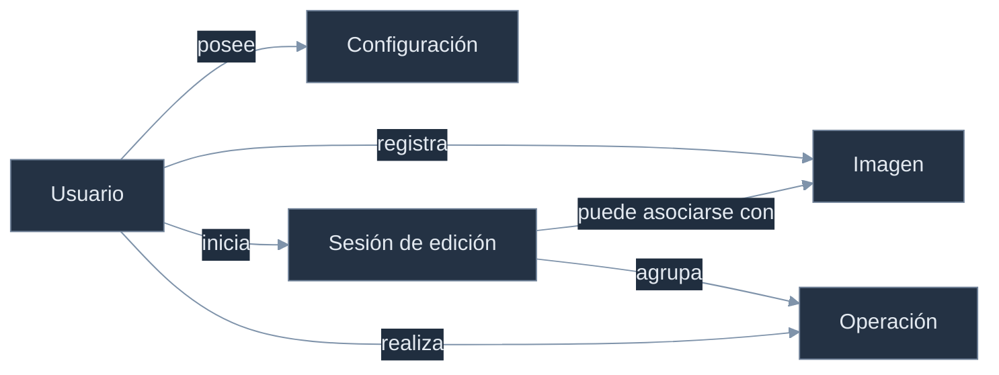

# Modelo Conceptual y Lógico de Artify

> **Proyecto:** Artify - Editor de Imágenes Web 
> **Programa:** Análisis y Desarrollo de Software - SENA 
> **Autor:** Iván Darío Madrid Daza 
> **Fecha:** Julio de 2026

---

## 1. Introducción

En este documento presento el modelo conceptual y lógico que corresponde a la versión implementada de Artify. Retomo el análisis realizado antes del desarrollo, pero actualizo las entidades, relaciones y decisiones de persistencia de acuerdo con el backend Node.js, la base PostgreSQL y las funciones que existen actualmente.

El diseño inicial fue una orientación útil. Durante la implementación comprobé qué información necesitaba persistencia y qué estado podía permanecer en el navegador. Como resultado, el modelo definitivo conserva cinco entidades y evita tablas que no aportaban valor al flujo actual.

## 2. Problema de Información

Artify permite que una persona cree una cuenta, inicie sesión y edite imágenes desde el navegador. La imagen se procesa con Canvas API en el equipo del usuario, pero la aplicación necesita conservar datos de autenticación, preferencias, sesiones, operaciones y metadatos de las descargas.

La base de datos debe responder, entre otras, estas preguntas:

- ¿Quién utiliza la aplicación y cuál es su rol?
- ¿Qué configuración pertenece a cada usuario?
- ¿Cuándo comienza y termina una sesión de edición?
- ¿Qué operaciones se confirman durante una sesión?
- ¿Qué metadatos tiene una imagen descargada?

## 3. Modelo Conceptual Vigente

**Figura 1** 
*Modelo conceptual vigente de Artify*

*Nota.* Elaboración propia a partir del comportamiento implementado y de `database/postgresql/schema.sql`.

### 3.1 Entidades

| Entidad | Responsabilidad conceptual |
| --- | --- |
| Usuario | Identifica a la persona, conserva sus credenciales protegidas, rol y estado. |
| Configuración | Guarda las preferencias principales de un usuario. |
| Imagen | Conserva metadatos de una imagen procesada y descargada; no almacena el archivo binario. |
| Sesión de edición | Representa un periodo de trabajo dentro del editor. |
| Operación | Registra una acción confirmada dentro de una sesión. |

## 4. Reglas Conceptuales

- Un usuario puede tener una sola configuración principal.
- Un usuario puede registrar muchas imágenes, sesiones y operaciones.
- Una sesión pertenece a un usuario y puede quedar asociada con una imagen descargada.
- Una sesión puede agrupar muchas operaciones.
- Una operación pertenece a una sesión y al usuario autenticado que la realizó.
- El historial de deshacer y rehacer se conserva localmente en el editor; no corresponde a una entidad persistente.

## 5. Transformación al Modelo Lógico

El modelo conceptual se implementa en PostgreSQL mediante cinco tablas. Los nombres de tablas permanecen en mayúsculas y cada columna usa un prefijo que identifica su tabla.

| Entidad | Tabla | Clave primaria | Relaciones principales |
| --- | --- | --- | --- |
| Usuario | `USUARIO` | `usr_id_usuario` | Entidad principal del modelo. |
| Configuración | `CONFIGURACION` | `cfg_id_configuracion` | `cfg_usr_id_usuario` referencia a `USUARIO`. |
| Imagen | `IMAGEN` | `img_id_imagen` | `img_usr_id_usuario` referencia a `USUARIO`. |
| Sesión de edición | `SESION_EDICION` | `ses_id_sesion` | Referencia a `USUARIO` y, opcionalmente, a `IMAGEN`. |
| Operación | `OPERACION` | `opr_id_operacion` | Referencia a `SESION_EDICION` y `USUARIO`. |

La definición completa de campos y restricciones se encuentra en [`../tecnica/base-datos.md`](../tecnica/base-datos.md), y el script ejecutable está en [`../../database/postgresql/schema.sql`](../../database/postgresql/schema.sql).

## 6. Evolución Frente al Diseño Inicial

| Decisión inicial | Estado implementado | Motivo |
| --- | --- | --- |
| MySQL y MySQL Workbench | PostgreSQL mediante `pg` | PostgreSQL es el motor oficial del proyecto. |
| Tabla `HISTORIAL` | No existe | Deshacer y rehacer funcionan en memoria y en el respaldo local del editor. |
| Tabla `IMAGEN_OPERACION` | No existe | Las operaciones se ordenan dentro de una sesión y no requieren una relación muchos a muchos. |
| Imágenes JPG y PNG | JPG, PNG y WebP | El editor vigente admite los tres formatos. |
| Almacenar archivos | Conservar metadatos | El procesamiento principal ocurre en Canvas y la base no guarda binarios. |
| Registro con datos personales amplios | Gestión de cuentas simplificada | El sistema conserva únicamente los datos necesarios para identificar y autenticar la cuenta. |

## 7. Justificación del Modelo Relacional

Elegí una base relacional porque las entidades tienen vínculos definidos y necesitan integridad referencial, de acuerdo con los principios de diseño relacional explicados por Coronel y Morris (2018). Las claves primarias identifican cada registro y las claves foráneas evitan sesiones, operaciones o configuraciones sin propietario. PostgreSQL también permite aplicar restricciones `UNIQUE`, `CHECK`, valores predeterminados e índices que apoyan la consistencia y las consultas de analíticas.

## 8. Conclusión

El modelo actual representa el funcionamiento real de Artify sin conservar estructuras que solo pertenecían a la planeación. Las cinco entidades cubren autenticación, personalización y trazabilidad básica, mientras el procesamiento de imágenes y el historial inmediato permanecen en el navegador. Esta separación hace que el modelo sea más sencillo, coherente y mantenible.

## 9. Referencias

- Coronel, C., & Morris, S. (2018). *Sistemas de bases de datos: Diseño, implementación y administración*. Cengage Learning.
- PostgreSQL Global Development Group. (s. f.). *PostgreSQL documentation*. https://www.postgresql.org/docs/
- Silberschatz, A., Korth, H. F., & Sudarshan, S. (2014). *Fundamentos de bases de datos*. McGraw-Hill.
