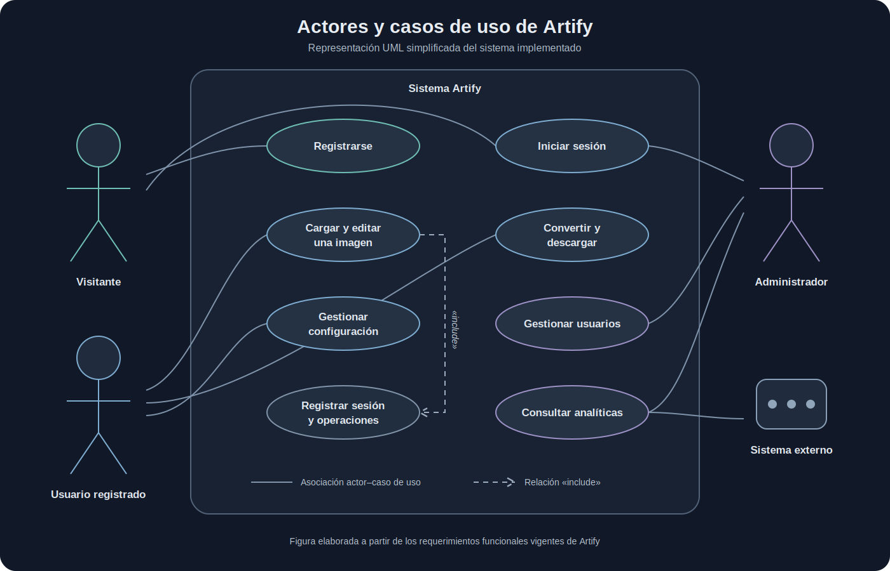
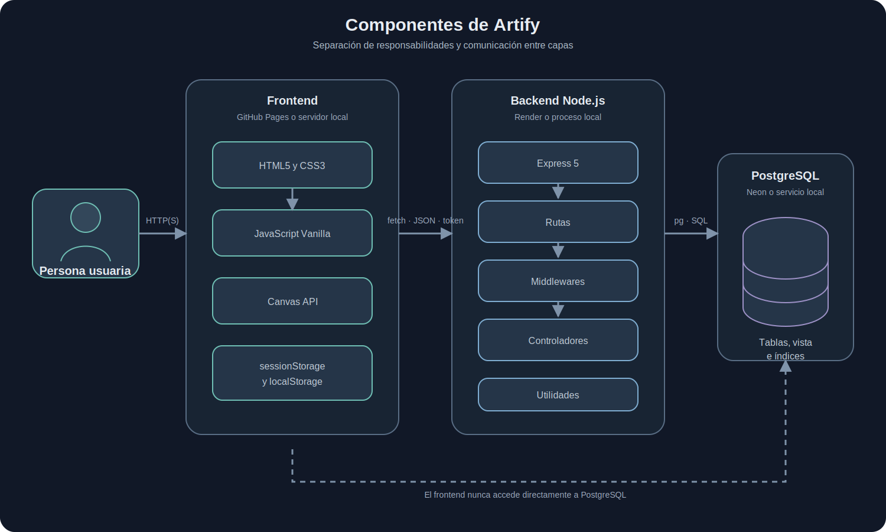

# Manual Técnico de Artify

## Evidencia GA10-220501097-AA10-EV01

**Elabora documentos técnicos y de usuario del software**

Iván Darío Madrid Daza<br>
Análisis y Desarrollo de Software<br>
Servicio Nacional de Aprendizaje (SENA)<br>
Instructor: José Ignacio Botero Osorio<br>
Julio de 2026

---

## Resumen

En este manual describo los elementos técnicos necesarios para comprender, instalar y verificar Artify, una aplicación web de edición de imágenes. Presento sus prerrequisitos, tecnologías, estándares, casos de uso, modelo de datos, componentes y scripts de instalación. El contenido corresponde al estado implementado del repositorio y utiliza PostgreSQL como motor oficial de persistencia.

**Palabras clave:** aplicación web, manual técnico, PostgreSQL, Node.js, Express, Canvas API.

## 1. Introducción

Artify permite cargar, editar, convertir y descargar imágenes desde un navegador. El sistema combina un frontend en HTML, CSS y JavaScript, una API construida con Node.js y Express, y una base de datos PostgreSQL.

El propósito de este manual es reunir la información que necesita una persona técnica para reconocer la estructura del sistema, preparar un entorno local y comprobar que sus componentes funcionan. La redacción se apoya en el código, los scripts y la documentación vigente del proyecto.

## 2. Objetivos

### 2.1 Objetivo general

Documentar la arquitectura, los requisitos y el procedimiento técnico de instalación de Artify de manera clara, verificable y coherente con la aplicación implementada.

### 2.2 Objetivos específicos

- Identificar las herramientas necesarias para ejecutar Artify.
- Describir las tecnologías y los estándares aplicados.
- Representar los actores, funciones, datos y componentes del sistema.
- Explicar los scripts y pasos principales de instalación.
- Definir comprobaciones para confirmar que el sistema está disponible.

## 3. Alcance

El manual cubre la instalación local tradicional en Windows o macOS, la estructura full stack y los objetos PostgreSQL del proyecto. No describe contenedores ni máquinas virtuales porque no forman parte de la arquitectura actual. Tampoco documenta funciones planeadas como si estuvieran implementadas.

### 3.1 Guía técnica relacionada

Este manual consolida la visión técnica del sistema y se complementa con el [Plan de instalación local de Artify](./plan-instalacion-artify.md). Esa guía contiene el procedimiento operativo completo para preparar Windows o macOS, configurar PostgreSQL, iniciar los servicios, ejecutar las pruebas y resolver problemas frecuentes. Cuando un comando resumido de esta evidencia necesite mayor detalle, tomo esa guía como referencia de instalación vigente.

## 4. Prerrequisitos de Instalación

**Tabla 1**<br>
*Prerrequisitos para instalar y ejecutar Artify*

| Herramienta | Versión o condición | Propósito |
| --- | --- | --- |
| Node.js | 22.13 o superior | Ejecutar el backend y las pruebas. |
| pnpm | 11.1.1 | Instalar y administrar dependencias. |
| PostgreSQL | 15 o superior | Crear `artify_db` y conservar los datos. |
| Git | Versión estable | Clonar y versionar el proyecto. |
| Navegador | Chrome, Edge, Firefox o Safari actual | Ejecutar el frontend y Canvas API. |
| Internet | Disponible durante la preparación | Clonar el repositorio e instalar paquetes. |

Antes de instalar compruebo:

```bash
node -v
pnpm -v
git --version
psql --version
```

El procedimiento detallado por sistema operativo está en el [Plan de instalación local](./plan-instalacion-artify.md).

## 5. Tecnologías, Frameworks y Estándares

**Tabla 2**<br>
*Tecnologías, frameworks y estándares aplicados en Artify*

| Área | Tecnología | Aplicación en Artify |
| --- | --- | --- |
| Interfaz | HTML5 y CSS3 | Estructura semántica, formularios y diseño adaptable. |
| Lógica cliente | JavaScript Vanilla | Interacción, consumo de API y editor. |
| Imágenes | Canvas API | Recorte, rotación, filtros, redimensionamiento y exportación. |
| Servidor | Node.js | Entorno de ejecución del backend. |
| Framework | Express 5 | Rutas HTTP, middlewares y respuestas JSON. |
| Datos | PostgreSQL y `pg` | Persistencia relacional y conexión desde Node.js. |
| Seguridad | bcrypt, token firmado y CORS | Contraseñas protegidas, autenticación y control de orígenes. |
| Pruebas | Node Test Runner y Playwright | Pruebas backend, frontend y E2E. |

El proyecto aplica separación por capas, API REST sobre HTTP/HTTPS, JSON para intercambio de datos, variables de entorno para secretos, claves primarias y foráneas para integridad, y convenciones de nombres descritas en [`coding-standards.md`](./coding-standards.md). Node.js proporciona el entorno de ejecución del backend (Node.js, s. f.), Express organiza el servidor y sus rutas (Express.js, s. f.), y pnpm administra las dependencias de forma reproducible (pnpm, s. f.). La persistencia aprovecha las relaciones, restricciones e índices de PostgreSQL (PostgreSQL Global Development Group, 2026). En el navegador, el uso de Canvas corresponde a la API web documentada por MDN Web Docs (s. f.). Para accesibilidad se usan HTML semántico, etiquetas, estados visibles y contraste verificable.

## 6. Diagrama de Casos de Uso

La siguiente figura presenta una representación UML simplificada de los actores, casos de uso y relaciones principales de Artify. Las líneas continuas muestran asociaciones con los actores; la línea discontinua `«include»` indica que la edición incorpora el registro interno de la sesión y sus operaciones.

**Figura 1**<br>
*Diagrama UML simplificado de actores y casos de uso de Artify*



*Nota.* Elaboración propia a partir de los requerimientos funcionales y del comportamiento implementado.

Los casos detallados y sus criterios de aceptación se encuentran en [`../proyecto/requerimientos-funcionales.md`](../proyecto/requerimientos-funcionales.md).

## 7. Modelo Entidad-Relación

**Figura 2**<br>
*Modelo entidad-relación de la implementación PostgreSQL de Artify*


*Nota.* Elaboración propia a partir de `database/postgresql/schema.sql`.

El modelo tiene cinco tablas. `USUARIO` es la entidad principal; `CONFIGURACION` mantiene una relación de uno a cero o uno; las imágenes, sesiones y operaciones mantienen relaciones de uno a muchos. Una sesión puede asociarse opcionalmente con una imagen.

El análisis completo se encuentra en [`normalizacion-modelo-relacional-artify.md`](./normalizacion-modelo-relacional-artify.md).

## 8. Diccionario de Datos

**Tabla 3**<br>
*Resumen del diccionario de datos de Artify*

| Tabla | Clave primaria | Claves foráneas | Propósito |
| --- | --- | --- | --- |
| `USUARIO` | `usr_id_usuario` | No aplica | Usuarios, credenciales, rol y estado. |
| `CONFIGURACION` | `cfg_id_configuracion` | `cfg_usr_id_usuario` | Preferencias de un usuario. |
| `IMAGEN` | `img_id_imagen` | `img_usr_id_usuario` | Metadatos de imágenes descargadas. |
| `SESION_EDICION` | `ses_id_sesion` | `ses_usr_id_usuario`, `ses_img_id_imagen` | Periodos de trabajo en el editor. |
| `OPERACION` | `opr_id_operacion` | `opr_ses_id_sesion`, `opr_usr_id_usuario` | Acciones confirmadas durante una sesión. |

PostgreSQL también contiene la vista `v_usuarios_activos`, que resume usuarios activos, imágenes y sesiones. El diccionario campo por campo, incluidos tipos, restricciones y reglas de eliminación, se mantiene en [`base-datos.md`](./base-datos.md). Esta separación evita duplicar una definición extensa que podría quedar desactualizada.

## 9. Diagrama de Componentes

**Figura 3**<br>
*Componentes lógicos y servicios de despliegue de Artify*



*Nota.* Elaboración propia a partir de la arquitectura vigente del repositorio.

El frontend no consulta PostgreSQL directamente. Toda operación persistente pasa por la API, que valida identidad, permisos y datos antes de ejecutar SQL.

## 10. Scripts de Instalación

**Tabla 4**<br>
*Recursos utilizados para instalar y preparar Artify*

| Recurso | Función |
| --- | --- |
| `scripts/setup.sh` | Script Bash que instala dependencias y crea `backend/.env` desde la plantilla en macOS o Linux. |
| PowerShell de Windows | No existe un script `.ps1` en el proyecto; la instalación se realiza con los comandos manuales de la sección 11. |
| `.env.example` | Define las variables requeridas sin incluir secretos reales. |
| `database/postgresql/schema.sql` | Crea las cinco tablas, índices, relaciones y vista. |
| `database/postgresql/seed.sql` | Carga un registro controlado de referencia. |
| `scripts/ejecutar-migraciones.js` | Aplica migraciones incrementales pendientes. |
| `database/postgresql/app-role.sql` | Crea o ajusta el rol técnico de menor privilegio. |

`scripts/setup.sh` utiliza Bash, por lo que no se ejecuta directamente desde PowerShell. En Windows realizo los pasos manuales equivalentes que se presentan a continuación y en el [Plan de instalación local](./plan-instalacion-artify.md). `schema.sql` elimina y vuelve a crear los objetos del proyecto; solo se utiliza para una base nueva o una restauración controlada con respaldo previo.

## 11. Procedimiento Resumido de Instalación

En ambos sistemas operativos clono el repositorio, configuro `backend/.env`, instalo las dependencias, creo `artify_db` y cargo los scripts SQL. Los comandos de copia cambian entre PowerShell y Bash.

### 11.1 Windows con PowerShell

Con PostgreSQL incluido en la variable `PATH`, ejecuto:

```powershell
git clone https://github.com/Tecno85/artify.git
cd artify
Copy-Item .env.example backend/.env
cd backend
pnpm install --frozen-lockfile
cd ..
createdb artify_db
psql -d artify_db -f database/postgresql/schema.sql
psql -d artify_db -f database/postgresql/seed.sql
```

### 11.2 macOS o Linux con Bash

```bash
git clone https://github.com/Tecno85/artify.git
cd artify
cp .env.example backend/.env
cd backend
pnpm install --frozen-lockfile
cd ..
createdb artify_db
psql -d artify_db -f database/postgresql/schema.sql
psql -d artify_db -f database/postgresql/seed.sql
```

Después de la preparación, inicio el backend en el puerto `3000`, sirvo `frontend/` en el puerto `8080` y compruebo salud, disponibilidad y flujo funcional. Para la configuración de credenciales, los puertos alternativos y la solución de problemas uso el [Plan de instalación local](./plan-instalacion-artify.md).

## 12. Variables de Entorno

```env
DB_HOST=localhost
DB_PORT=5432
DB_USER=postgres
DB_PASSWORD=tu_contrasena_postgresql
DB_NAME=artify_db
TOKEN_SECRET=reemplazar_por_un_secreto_largo_y_aleatorio
PORT=3000
NODE_ENV=development
CORS_ORIGIN=http://localhost:8080,http://127.0.0.1:8080
```

El archivo real `backend/.env` no se versiona. En producción se utiliza `DATABASE_URL` para PostgreSQL administrado y se configuran los secretos desde la plataforma.

## 13. Ejecución y Verificación

Backend:

```bash
cd backend
pnpm start
```

Frontend, desde la raíz y en otra terminal:

```bash
python3 -m http.server 8080 --directory frontend
```

Comprobaciones:

**Tabla 5**<br>
*Comprobaciones técnicas posteriores a la instalación*

| Recurso | Resultado esperado |
| --- | --- |
| `http://127.0.0.1:3000/health` | El proceso Express está activo. |
| `http://127.0.0.1:3000/ready` | El backend puede consultar PostgreSQL. |
| `http://127.0.0.1:8080` | Se presenta la interfaz de Artify. |
| `pnpm run check` | La sintaxis del backend es válida. |
| `pnpm run test:frontend` | Las pruebas del frontend terminan correctamente. |

Las pruebas de integración solo deben ejecutarse con `NODE_ENV=test`, autorización de mutaciones y una base cuyo nombre termine en `_test`. Nunca deben apuntar a producción.

## 14. Seguridad Técnica

- Las contraseñas se almacenan como hash con bcrypt.
- Las rutas privadas exigen un token firmado.
- El backend vuelve a comprobar el estado y el rol del usuario.
- El panel administrativo requiere rol `admin`.
- CORS restringe los orígenes autorizados.
- Los cuerpos HTTP tienen un límite de tamaño y los errores se devuelven como JSON controlado.
- PostgreSQL aplica claves foráneas, unicidad y restricciones `CHECK`.
- Los secretos permanecen fuera del repositorio.

## 15. Problemas Frecuentes

**Tabla 6**<br>
*Problemas frecuentes y revisiones recomendadas*

| Problema | Revisión recomendada |
| --- | --- |
| `psql` no se reconoce | Verificar la instalación y agregar la carpeta `bin` al `PATH`. |
| `/ready` responde con error | Revisar servicio PostgreSQL, base, usuario y variables `DB_*`. |
| El frontend no consume la API | Confirmar puerto, `config.js` y `CORS_ORIGIN`. |
| El puerto está ocupado | Detener el proceso anterior o configurar un puerto alternativo. |
| El login no permite entrar | Verificar credenciales, estado del usuario y secreto del token. |

## 16. Conclusiones

Al elaborar este manual comprobé que Artify dispone de una arquitectura separada, un modelo PostgreSQL normalizado y scripts suficientes para reproducir una instalación local. Los diagramas representan el sistema implementado y no el diseño preliminar. La documentación especializada permite mantener el diccionario y el modelo sin duplicarlos por completo dentro de la evidencia.

## 17. Referencias

Express.js. (s. f.). *El framework web rápido, minimalista y sin imposiciones para Node.js*. https://expressjs.com/es/

MDN Web Docs. (s. f.). *API Canvas*. https://developer.mozilla.org/es/docs/Web/API/Canvas_API

Node.js. (s. f.). *Introducción a Node.js* [Documentación en inglés]. https://nodejs.org/learn/getting-started/introduction-to-nodejs

pnpm. (s. f.). *Instalación*. https://pnpm.io/es/installation

PostgreSQL Global Development Group. (2026). *Documentación de PostgreSQL 18.4* [Documentación en inglés]. https://www.postgresql.org/docs/current/

## Anexo A. Correspondencia con la Evidencia

**Tabla 7**<br>
*Correspondencia entre los elementos solicitados y el contenido del manual*

| Elemento solicitado | Sección |
| --- | --- |
| Normas APA y artefacto documental | Portada, figuras y referencias |
| Prerrequisitos | Sección 4 |
| Frameworks y estándares | Sección 5 |
| Diagrama de casos de uso | Sección 6 |
| Modelo entidad-relación | Sección 7 |
| Diccionario de datos | Sección 8 y documento enlazado |
| Scripts de instalación | Secciones 10 y 11 |
| Diagrama de componentes | Sección 9 |
