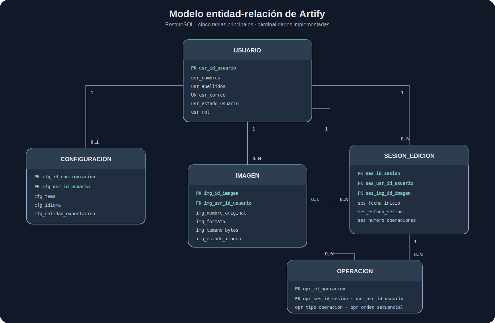

# Normalización y Modelo Relacional de Artify

> **Proyecto:** Artify - Editor de Imágenes Web 
> **Programa:** Análisis y Desarrollo de Software - SENA 
> **Autor:** Iván Darío Madrid Daza 
> **Fecha:** Julio de 2026

---

## 1. Introducción

En este documento verifico la normalización y las relaciones del modelo PostgreSQL implementado en Artify. El análisis parte de `database/postgresql/schema.sql`, que es la fuente ejecutable del esquema, y actualiza el trabajo realizado durante la planeación del proyecto.

## 2. Objetivo

Comprobar que las tablas principales cumplen la Primera, Segunda y Tercera Forma Normal, y documentar sus cardinalidades, claves y reglas de integridad de acuerdo con la implementación vigente.

## 3. Modelo Entidad-Relación Implementado

**Figura 1** 
*Modelo entidad-relación de la implementación PostgreSQL*

*Nota.* Elaboración propia a partir de `database/postgresql/schema.sql`. Se muestran los campos principales; el diccionario completo se encuentra en [`base-datos.md`](./base-datos.md).

## 4. Relaciones y Cardinalidades

| Origen | Destino | Cardinalidad | Implementación |
| --- | --- | --- | --- |
| `USUARIO` | `CONFIGURACION` | 1 a 0..1 | FK obligatoria y `UNIQUE` en `cfg_usr_id_usuario`. |
| `USUARIO` | `IMAGEN` | 1 a 0..N | FK `img_usr_id_usuario`. |
| `USUARIO` | `SESION_EDICION` | 1 a 0..N | FK `ses_usr_id_usuario`. |
| `USUARIO` | `OPERACION` | 1 a 0..N | FK `opr_usr_id_usuario`. |
| `IMAGEN` | `SESION_EDICION` | 0..1 a 0..N | FK opcional `ses_img_id_imagen`; al eliminar la imagen se asigna `NULL`. |
| `SESION_EDICION` | `OPERACION` | 1 a 0..N | FK obligatoria `opr_ses_id_sesion`. |

## 5. Criterios de Normalización

- **Primera Forma Normal (1FN):** cada columna almacena un valor correspondiente a su dominio y no existen grupos repetitivos.
- **Segunda Forma Normal (2FN):** cada atributo no clave depende de toda la clave primaria. Las tablas usan claves primarias simples, por lo que no existen dependencias parciales de una clave compuesta.
- **Tercera Forma Normal (3FN):** los atributos no clave describen la entidad identificada por la clave primaria y no dependen funcionalmente de otro atributo no clave.

Los campos `jsonb` se usan para preferencias o parámetros variables que se consumen como una unidad. No sustituyen relaciones entre las entidades principales. Esta verificación sigue los principios de dependencia funcional y normalización descritos por Date (2005) y Silberschatz et al. (2014).

## 6. Verificación por Tabla

### 6.1 `USUARIO`

Cumple 1FN porque cada campo representa un dato individual; 2FN porque todos los datos personales, de acceso y de estado dependen de `usr_id_usuario`; y 3FN porque no se usa un atributo no clave para determinar otro. El correo tiene unicidad, pero no reemplaza la clave primaria.

### 6.2 `CONFIGURACION`

Cumple 1FN al conservar una preferencia por columna o un objeto `jsonb` tratado como unidad; 2FN porque todos los atributos dependen de `cfg_id_configuracion`; y 3FN porque tema, idioma, calidad y ayudas no se derivan entre sí. La unicidad de `cfg_usr_id_usuario` aplica la regla de una configuración principal por usuario.

### 6.3 `IMAGEN`

Cumple 1FN porque nombre, formato, dimensiones, tamaño, fechas y estado se almacenan por separado; 2FN porque dependen de `img_id_imagen`; y 3FN porque no se almacenan datos descriptivos del usuario dentro de la tabla. La relación se mantiene solo mediante `img_usr_id_usuario`.

### 6.4 `SESION_EDICION`

Cumple 1FN porque fechas, estado, duración y contadores tienen columnas separadas; 2FN porque todos dependen de `ses_id_sesion`; y 3FN porque los datos del usuario y de la imagen no se duplican. `ses_duracion_minutos` y `ses_numero_operaciones` son valores operativos controlados por el backend para facilitar consulta y trazabilidad.

### 6.5 `OPERACION`

Cumple 1FN porque tipo, fecha, orden, estado y tiempo se almacenan individualmente; 2FN porque todos dependen de `opr_id_operacion`; y 3FN porque los datos de la sesión y del usuario permanecen en sus tablas. `opr_parametros` conserva los parámetros propios de una operación sin introducir otra entidad estable.

## 7. Integridad Referencial

- Las dependencias del usuario usan `ON DELETE CASCADE` para no dejar configuraciones, imágenes, sesiones u operaciones huérfanas.
- Las operaciones dependen de una sesión y se eliminan con ella.
- La asociación de sesión con imagen usa `ON DELETE SET NULL`, porque la sesión puede conservar su trazabilidad aunque la imagen deje de estar disponible.
- Todas las claves foráneas usan `ON UPDATE CASCADE`.
- Las restricciones `CHECK` controlan estados, roles, tema, calidad y valores numéricos.

## 8. Evolución del Modelo

El diseño anterior incluía `HISTORIAL` e `IMAGEN_OPERACION`. Estas tablas no forman parte del esquema implementado. El historial inmediato se mantiene en el navegador para deshacer y rehacer, mientras cada operación persistida se asocia directamente con una sesión y un usuario. Esta decisión elimina una relación muchos a muchos que no era necesaria para el flujo real.

## 9. Conclusión

Confirmo que las cinco tablas principales cumplen las tres primeras formas normales dentro del alcance de Artify. El modelo evita duplicar datos de usuarios, mantiene relaciones explícitas y aplica restricciones desde PostgreSQL. La estructura resultante es menor que la propuesta inicial, pero representa con mayor fidelidad la aplicación construida.

## 10. Referencias

- Date, C. J. (2005). *Introducción a los sistemas de bases de datos*. Addison-Wesley.
- PostgreSQL Global Development Group. (s. f.). *PostgreSQL documentation*. https://www.postgresql.org/docs/
- Silberschatz, A., Korth, H. F., & Sudarshan, S. (2014). *Fundamentos de bases de datos*. McGraw-Hill.
