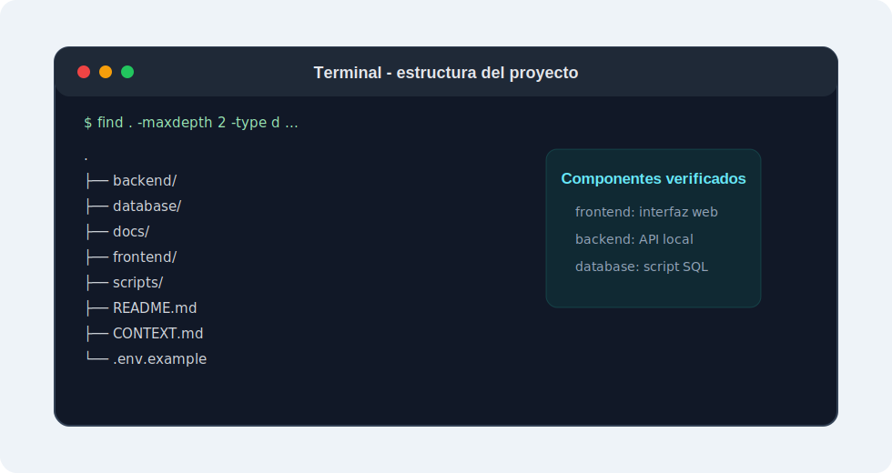
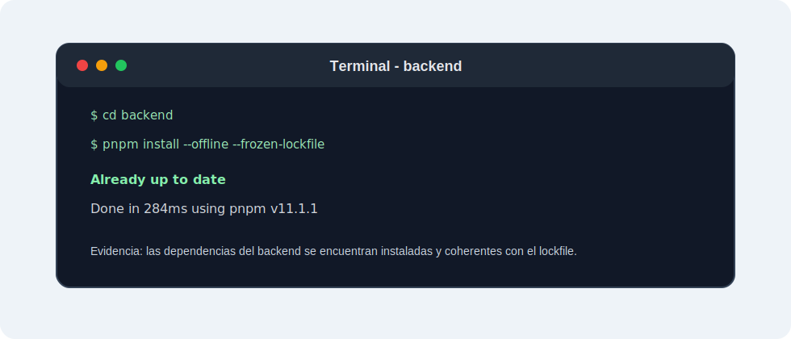
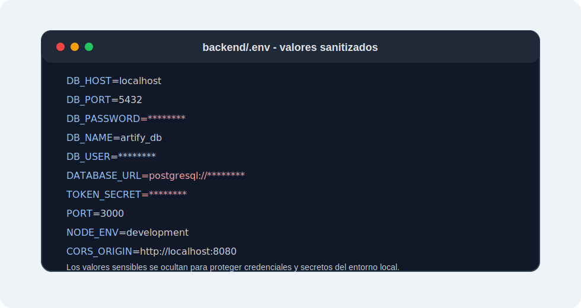
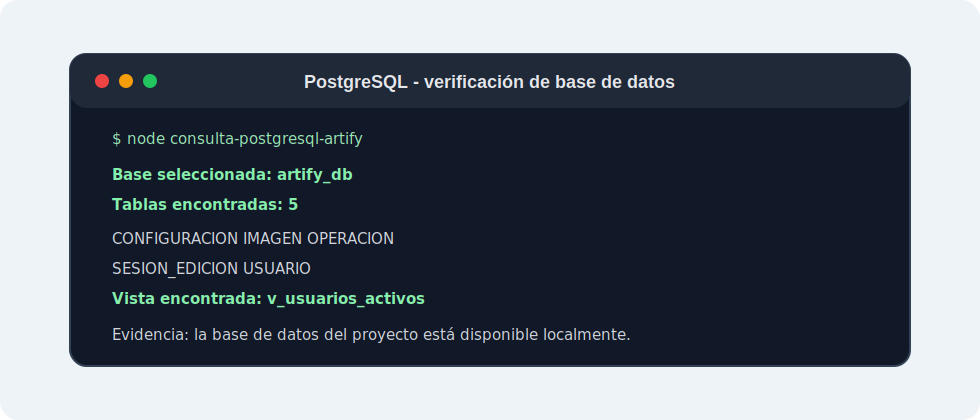
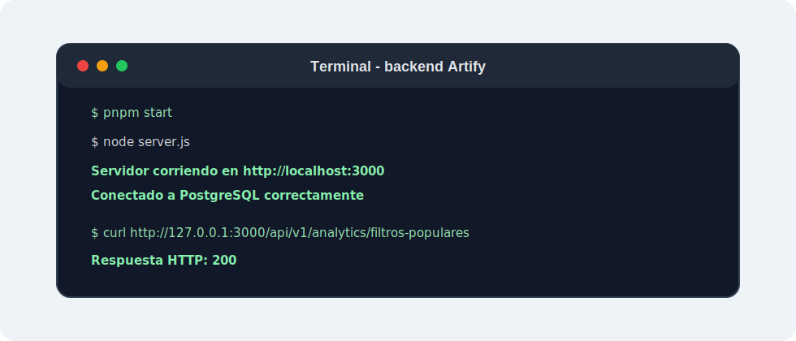
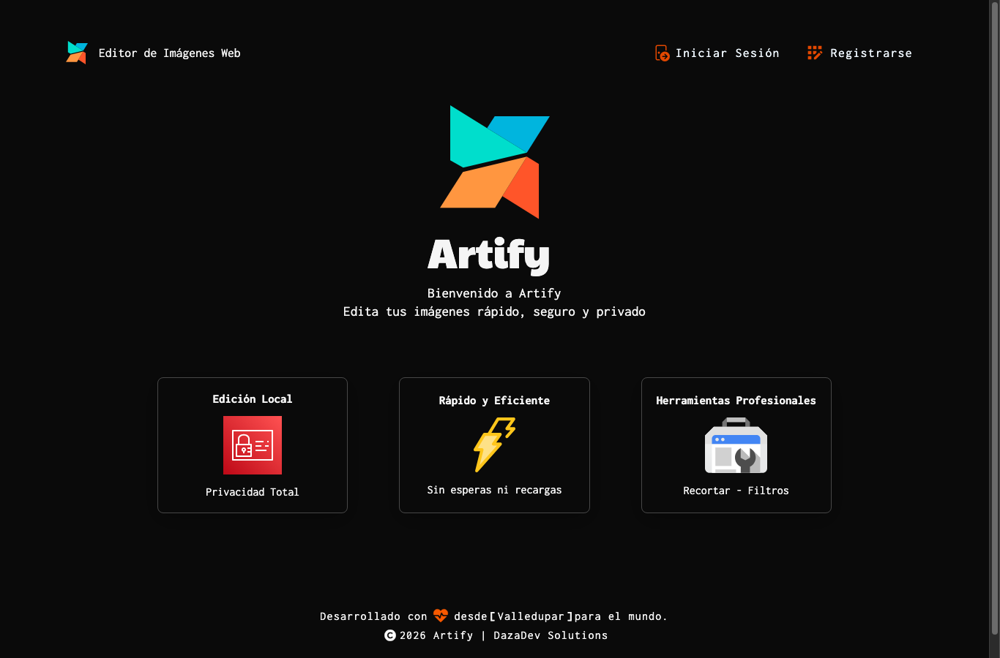

# Plan de Instalación Local de Artify

> **Proyecto:** Artify - Editor de Imágenes Web
> **Evidencia:** GA10-220501097-AA3
> **Programa:** Análisis y Desarrollo de Software - SENA
> **Autor:** Iván Darío Madrid Daza
> **Fecha:** Mayo 2026
> **Última actualización:** Julio 2026

---

## 1. Introducción

En este plan documento cómo instalo y ejecuto Artify en un equipo local. El procedimiento está dirigido a estudiantes de desarrollo de software y separa la preparación de Windows y macOS. Después de preparar las herramientas, ambos sistemas siguen el mismo flujo para configurar PostgreSQL, iniciar el backend y servir el frontend.

### 1.1 Cobertura de la evidencia

| Requisito solicitado | Ubicación |
| --- | --- |
| Selección de la plataforma | Sección 10 |
| Preparación del entorno | Secciones 4 y 5 |
| Montaje del servidor de aplicaciones | Sección 6 |
| Configuración de PostgreSQL | Sección 6 |
| Ejecución del frontend | Sección 6 |
| Verificación del producto | Sección 7 |
| Evidencias visuales | Sección 11 |
| Requisitos no funcionales | Sección 10 |
| Máquinas virtuales y contenedores | Sección 10 |

---

## 2. Resultado Esperado

Al finalizar tendré estos componentes activos:

| Componente | Dirección o recurso esperado |
| --- | --- |
| Frontend | `http://127.0.0.1:8080` |
| Backend | `http://127.0.0.1:3000` |
| Estado del backend | `http://127.0.0.1:3000/health` |
| Conexión con PostgreSQL | `http://127.0.0.1:3000/ready` |
| Base de datos | `artify_db` |

Durante la ejecución mantengo abiertas dos terminales: una para el backend y otra para el frontend.

---

## 3. Requisitos

| Herramienta | Versión o condición |
| --- | --- |
| Node.js | 22.13 o superior |
| pnpm | 11.1.1 |
| PostgreSQL | 15 o superior |
| Git | Versión estable |
| Navegador | Chrome, Edge, Firefox o Safari actual |
| Conexión a Internet | Necesaria para clonar e instalar dependencias |

El backend declara las versiones de Node.js y pnpm en `backend/package.json`. No continúo hasta que `node -v`, `pnpm -v`, `git --version` y `psql --version` respondan correctamente.

---

## 4. Preparación en Windows

Uso PowerShell para ejecutar los comandos.

### 4.1 Instalar las herramientas

1. Instalo Node.js desde `https://nodejs.org/en/download` y confirmo que la versión sea 22.13 o superior.
2. Instalo Git desde `https://git-scm.com/download/win`.
3. Instalo PostgreSQL desde `https://www.postgresql.org/download/windows/`.
4. Durante la instalación de PostgreSQL conservo el puerto `5432`, anoto la contraseña del usuario `postgres` e incluyo las herramientas de línea de comandos.
5. Cierro y vuelvo a abrir PowerShell para actualizar el `PATH`.

Instalo la versión de pnpm definida por Artify:

```powershell
npm install --global pnpm@11.1.1
```

### 4.2 Verificar Windows

```powershell
node -v
pnpm -v
git --version
psql --version
```

Resultados mínimos:

```text
Node.js: v22.13.0 o superior
pnpm: 11.1.1
PostgreSQL: 15 o superior
```

Si PowerShell bloquea `npm.ps1` o `pnpm.ps1`, puedo usar `npm.cmd` y `pnpm.cmd` sin cambiar la política de ejecución. Si no reconoce `psql`, agrego al `PATH` la carpeta `bin` de la instalación de PostgreSQL y abro una nueva terminal.

---

## 5. Preparación en macOS

Uso Terminal con `zsh`, `bash` o `fish`. Debo confirmar cuál shell está activo antes de modificar el `PATH`.

### 5.1 Instalar las herramientas

1. Instalo Node.js desde `https://nodejs.org/en/download` y confirmo que la versión sea 22.13 o superior.
2. Verifico Git con `git --version`. Si macOS solicita las Command Line Tools, completo esa instalación.
3. Instalo PostgreSQL usando una de las opciones oficiales publicadas en `https://www.postgresql.org/download/macosx/`.
4. Inicio PostgreSQL con la herramienta elegida y confirmo que `psql` esté disponible en el `PATH`.

Instalo la versión de pnpm definida por Artify:

```bash
npm install --global pnpm@11.1.1
```

### 5.2 Verificar macOS

```bash
node -v
pnpm -v
git --version
psql --version
```

Si la terminal sigue mostrando una versión anterior de Node.js, reviso qué ejecutable está usando:

```bash
which node
node -v
```

En `fish` no uso instrucciones escritas exclusivamente para `nvm` de Bash o Zsh. Primero debo instalar un gestor compatible o utilizar el instalador oficial de Node.js.

---

## 6. Instalación Común de Artify

Desde este punto los pasos son iguales en Windows y macOS. Cuando un comando cambie, incluyo ambos bloques.

### 6.1 Clonar el repositorio

**Ubicación:** carpeta donde guardaré el proyecto.

```bash
git clone https://github.com/Tecno85/artify.git
cd artify
```

Confirmo que existen `frontend/`, `backend/`, `database/`, `docs/` y `scripts/`.

### 6.2 Instalar las dependencias

**Ubicación:** raíz `artify/`.

```bash
cd backend
```

Una vez dentro de `backend/`, vuelvo a comprobar la versión y la ruta de los ejecutables. Esta revisión es importante porque una terminal puede resolver una instalación de Node.js diferente después de cambiar de carpeta.

**Windows - PowerShell:**

```powershell
node -v
pnpm -v
(Get-Command node).Source
(Get-Command pnpm).Source
```

**macOS - Terminal:**

```bash
node -v
pnpm -v
command -v node
command -v pnpm
```

Debo seguir viendo Node.js `22.13.0` o superior y pnpm `11.1.1`. Si la versión cambia o aparece Node.js `22.12.0`, corrijo el `PATH`, abro una terminal nueva y repito la comprobación antes de instalar.

Instalo exactamente las dependencias registradas en el lockfile y regreso a la raíz:

```bash
pnpm install --frozen-lockfile
cd ..
```

No ejecuto `npm install` dentro de `backend/` porque el proyecto usa pnpm y `backend/pnpm-lock.yaml`.

### 6.3 Crear `backend/.env`

**Windows - PowerShell:**

```powershell
Copy-Item .env.example backend/.env
```

**macOS - Terminal:**

```bash
cp .env.example backend/.env
```

Genero un secreto local de 64 caracteres y copio el resultado para usarlo como `TOKEN_SECRET`:

```bash
node -e "console.log(require('node:crypto').randomBytes(32).toString('hex'))"
```

Para la instalación local dejo `DATABASE_URL` comentada y uso las variables `DB_*`. En `backend/.env` configuro:

```env
# DATABASE_URL se reserva para despliegues como Neon
DB_HOST=localhost
DB_PORT=5432
DB_USER=postgres
DB_PASSWORD=REEMPLAZAR_CON_LA_CONTRASENA_LOCAL
DB_NAME=artify_db

TOKEN_SECRET=REEMPLAZAR_CON_UN_SECRETO_LARGO_Y_ALEATORIO
PORT=3000
NODE_ENV=development
CORS_ORIGIN=http://localhost:8080,http://127.0.0.1:8080
```

Reemplazo obligatoriamente los dos valores que comienzan con `REEMPLAZAR_`. Los ejemplos siguientes usan el usuario PostgreSQL `postgres`. Si mi instalación creó otro usuario, utilizo ese mismo nombre en los comandos y en `DB_USER`.

Si una contraseña o cualquier otro valor contiene espacios o el carácter `#`, lo encierro entre comillas dobles para evitar que `dotenv` lo interprete de forma incompleta:

```env
DB_PASSWORD="mi clave local#segura"
TOKEN_SECRET="un secreto local con espacios"
```

### 6.4 Comprobar las credenciales PostgreSQL

Antes de crear la base verifico que las mismas credenciales del `.env` permitan una conexión TCP local:

```bash
psql -h localhost -U postgres -d postgres
```

Escribo la contraseña cuando PostgreSQL la solicite. Si la conexión funciona, salgo con:

```sql
\q
```

### 6.5 Crear y cargar `artify_db`

**Ubicación:** raíz `artify/`.

```bash
createdb -h localhost -U postgres artify_db
psql -h localhost -U postgres -d artify_db -f database/postgresql/schema.sql
psql -h localhost -U postgres -d artify_db -f database/postgresql/seed.sql
```

Si `artify_db` ya existe, no vuelvo a crearla. `schema.sql` elimina y reconstruye los objetos de Artify; antes de ejecutarlo sobre una base con datos útiles realizo un respaldo.

Verifico las tablas y la vista:

```bash
psql -h localhost -U postgres -d artify_db -c "\dt"
psql -h localhost -U postgres -d artify_db -c "\dv"
```

Debo encontrar cinco tablas principales y la vista `v_usuarios_activos`.

### 6.6 Iniciar el backend

**Terminal 1 - ubicación inicial:** raíz `artify/`.

```bash
cd backend
pnpm start
```

Resultado esperado:

```text
Conectado a PostgreSQL correctamente
Servidor corriendo en http://localhost:3000
```

Mantengo esta terminal abierta. Detengo el backend con `Ctrl + C` cuando termine.

### 6.7 Iniciar el frontend

**Terminal 2 - ubicación:** raíz `artify/`.

```bash
npx --yes http-server@14.1.1 frontend -p 8080
```

Uso `http-server@14.1.1` para que todos los compañeros ejecuten la misma versión. La primera vez, `npx` puede descargarla temporalmente. Mantengo esta terminal abierta y abro:

```text
http://127.0.0.1:8080
```

En local, `frontend/assets/js/config.js` conserva `ARTIFY_API_URL` vacío. `auth.js` usa el mismo protocolo y hostname del frontend en el puerto `3000`; al seguir esta guía desde `http://127.0.0.1:8080`, la API será `http://127.0.0.1:3000`.

---

## 7. Verificación

### 7.1 Servicios

En una tercera terminal ejecuto:

**Windows - PowerShell:**

```powershell
curl.exe http://127.0.0.1:3000/health
curl.exe http://127.0.0.1:3000/ready
```

**macOS - Terminal:**

```bash
curl http://127.0.0.1:3000/health
curl http://127.0.0.1:3000/ready
```

Ambas respuestas deben incluir `"ok": true`.

### 7.2 Sintaxis y pruebas automatizadas

**Ubicación inicial:** raíz `artify/`.

```bash
createdb -h localhost -U postgres artify_test
psql -h localhost -U postgres -d artify_test -f database/postgresql/schema.sql
psql -h localhost -U postgres -d artify_test -f database/postgresql/seed.sql
```

Si `artify_test` ya existe, no repito `createdb`. Primero valido la sintaxis:

```bash
cd backend
pnpm run check
```

Ejecuto la suite con una confirmación explícita y sobrescribo únicamente el
nombre de la base para esta orden.

**Windows - PowerShell:**

```powershell
$env:NODE_ENV = 'test'
$env:DB_NAME = 'artify_test'
$env:ALLOW_TEST_DB_MUTATIONS = 'true'
pnpm test
Remove-Item Env:NODE_ENV
Remove-Item Env:DB_NAME
Remove-Item Env:ALLOW_TEST_DB_MUTATIONS
```

**macOS - Terminal:**

```bash
NODE_ENV=test DB_NAME=artify_test ALLOW_TEST_DB_MUTATIONS=true pnpm test
```

La suite esperada contiene 28 pruebas. Si falla antes de iniciar, verifico que
PostgreSQL esté activo, que `artify_test` tenga el esquema cargado y que
`DATABASE_URL` continúe comentada en `backend/.env`.

Después ejecuto las 14 pruebas del frontend. Estas no usan PostgreSQL ni crean datos:

```bash
pnpm run test:frontend
```

Para comprobar el flujo real del editor instalo Chromium una sola vez y ejecuto
la prueba E2E. Esta prueba tampoco modifica PostgreSQL porque simula las
respuestas necesarias de la API:

```bash
pnpm exec playwright install chromium
pnpm run test:e2e
```

> **Protección activa:** la suite crea, modifica y elimina datos temporales, pero
> ahora se detiene antes de conectarse si el entorno no es `test`, falta la
> confirmación o la base no termina en `_test`. También rechaza hosts remotos;
> solo una base remota exclusiva puede habilitarse adicionalmente con
> `ALLOW_REMOTE_TEST_DATABASE=true`. Nunca uso esa excepción con Neon o
> producción.

### 7.3 Flujo funcional

1. Abro `http://127.0.0.1:8080`.
2. Registro un usuario.
3. Inicio sesión.
4. Cargo una imagen.
5. Aplico un filtro.
6. Descargo la imagen.
7. Cierro sesión.

### 7.4 Lista de comprobación

- [ ] Node.js, pnpm, Git y PostgreSQL responden desde la terminal.
- [ ] `backend/.env` contiene credenciales locales válidas.
- [ ] `artify_db` contiene las tablas y la vista.
- [ ] `/health` responde correctamente.
- [ ] `/ready` confirma PostgreSQL.
- [ ] El frontend abre en el puerto `8080`.
- [ ] Registro, login, editor y descarga funcionan.
- [ ] `pnpm run check`, `pnpm test`, `pnpm run test:frontend` y `pnpm run test:e2e` finalizan correctamente.

---

## 8. Configuración Opcional de Administrador

Primero registro el usuario desde Artify. Después, desde la raíz del proyecto, promuevo su rol:

**Windows - PowerShell:**

```powershell
psql -h localhost -U postgres -d artify_db -v "correo=admin@artify.com" -f database/postgresql/promote-admin.sql
```

**macOS - Terminal:**

```bash
psql -h localhost -U postgres -d artify_db -v correo='admin@artify.com' -f database/postgresql/promote-admin.sql
```

Reemplazo `admin@artify.com` por el correo registrado. Al iniciar sesión, Artify dirige al usuario con rol `admin` al panel administrativo.

---

## 9. Problemas Frecuentes

### 9.1 Problemas comunes

| Problema | Revisión concreta |
| --- | --- |
| pnpm exige Node.js 22.13 o superior | Ejecuto `node -v` y reviso qué Node usa la terminal. |
| `database "artify_db" does not exist` | Creo la base antes de cargar `schema.sql`. |
| `password authentication failed` | Uso en `.env` el mismo usuario y contraseña probados con `psql -h localhost`. |
| `/health` funciona y `/ready` falla | Reviso PostgreSQL, `DB_*`, el esquema y los logs del backend. |
| `Failed to fetch` en el frontend | Confirmo backend activo, puerto `3000` y `CORS_ORIGIN`. |
| Puerto `3000` o `8080` ocupado | Cierro el proceso anterior o sigo la configuración completa de puertos alternativos. |
| Las pruebas fallan por conexión | Confirmo PostgreSQL activo y variables cargadas en `backend/.env`. |

### 9.2 Usar puertos alternativos

No basta con cambiar un solo comando: el backend, CORS y el frontend deben conservar direcciones coherentes.

Si el backend debe usar el puerto `3001`, modifico `backend/.env`:

```env
PORT=3001
CORS_ORIGIN=http://localhost:8080,http://127.0.0.1:8080
```

Después configuro el frontend local para apuntar al nuevo puerto. Edito temporalmente `frontend/assets/js/config.js`:

```javascript
window.ARTIFY_API_URL = "http://localhost:3001";
```

Reinicio el backend y recargo el navegador. Antes de crear un commit, restauro `window.ARTIFY_API_URL = "";` para conservar el fallback local oficial.

Si el frontend debe usar el puerto `8081`, actualizo `backend/.env`:

```env
CORS_ORIGIN=http://localhost:8081,http://127.0.0.1:8081
```

Reinicio el backend para volver a cargar CORS y ejecuto:

```bash
npx --yes http-server@14.1.1 frontend -p 8081
```

Abro `http://127.0.0.1:8081`. Si cambio ambos puertos, aplico los dos grupos de ajustes.

### 9.3 Windows

| Problema | Solución |
| --- | --- |
| `psql` no se reconoce | Agrego la carpeta `bin` de PostgreSQL al `PATH` y reinicio PowerShell. |
| PowerShell bloquea `npm.ps1` o `pnpm.ps1` | Uso `npm.cmd` o `pnpm.cmd` para ejecutar los comandos. |
| PostgreSQL no inicia | Reviso el servicio PostgreSQL desde Servicios de Windows. |

### 9.4 macOS

| Problema | Solución |
| --- | --- |
| `psql` no se reconoce | Agrego al `PATH` la carpeta de herramientas de la distribución instalada. |
| La terminal usa Node.js 22.12 u otra versión | Reviso `which node`, actualizo el `PATH` y abro una terminal nueva. |
| PostgreSQL rechaza el usuario `postgres` | Uso el rol creado por mi distribución y actualizo `DB_USER`. |
| `nvm` no existe en `fish` | Uso el instalador oficial o un gestor compatible con `fish`. |

---

## 10. Fundamentación Académica

### 10.1 Plataforma seleccionada

Selecciono Node.js como plataforma principal porque ejecuta el backend JavaScript de Artify y se integra con Express y PostgreSQL. El entorno se completa con pnpm para dependencias, Git para control de versiones y un navegador para el frontend.

| Componente | Responsabilidad |
| --- | --- |
| Frontend | Presentar la interfaz y editar imágenes con Canvas API. |
| Backend | Gestionar API, autenticación, sesiones, administración y analíticas. |
| PostgreSQL | Persistir usuarios, configuraciones, sesiones, operaciones e imágenes. |
| Variables de entorno | Separar credenciales y configuración del código. |

### 10.2 Requisitos no funcionales

| Requisito | Aplicación local |
| --- | --- |
| Seguridad | Mantengo `.env` fuera de Git y no comparto credenciales. |
| Disponibilidad | PostgreSQL, backend y frontend permanecen activos durante la prueba. |
| Mantenibilidad | Uso las versiones y comandos oficiales del repositorio. |
| Compatibilidad | Documento por separado las diferencias de Windows y macOS. |
| Rendimiento | El equipo debe soportar PostgreSQL, Node.js y el navegador al mismo tiempo. |

### 10.3 Máquinas virtuales y contenedores

Para esta evidencia realizo una instalación directa. Una máquina virtual o un contenedor podrían mejorar el aislamiento y la reproducibilidad, pero agregarían una capa que no forma parte de la arquitectura actual ni es necesaria para validar el montaje local.

---

## 11. Evidencias Visuales

Las siguientes evidencias conservan la trazabilidad académica del proceso:

Los archivos SVG son representaciones visuales sanitizadas y reconstruidas a partir de las verificaciones descritas; no son capturas literales de terminal ni sustituyen la ejecución de los comandos. `frontend-artify.png` sí corresponde a una captura del navegador. Para sustentar la instalación, acompaño estas imágenes con la ejecución local de `/health`, `/ready`, `pnpm run check`, `pnpm test` sobre una base exclusiva de pruebas y `pnpm run test:frontend`.

1. Estructura del proyecto.

   

2. Dependencias instaladas con pnpm.

   

3. Representación didáctica de las variables de entorno, sanitizada y sin secretos reales.

   

4. PostgreSQL y tablas de Artify.

   

5. Backend ejecutándose.

   

6. Frontend abierto en el navegador.

   

---

## 12. Conclusión

Este plan me permite instalar Artify de manera reproducible en Windows o macOS. La separación por sistema operativo reduce errores de herramientas y `PATH`, mientras que el procedimiento común mantiene una sola fuente para configurar PostgreSQL, backend, frontend y pruebas.

La instalación queda aceptada cuando `/health` y `/ready` responden correctamente, la suite automatizada finaliza sin fallos y el flujo de registro, login, edición y descarga funciona desde el navegador.

---

## 13. Referencias Oficiales

- Node.js. Descarga oficial: https://nodejs.org/en/download
- pnpm. Instalación: https://pnpm.io/installation
- PostgreSQL. Descarga para Windows: https://www.postgresql.org/download/windows/
- PostgreSQL. Descarga para macOS: https://www.postgresql.org/download/macosx/
- Git. Descargas: https://git-scm.com/downloads
- Express. Documentación: https://expressjs.com/
