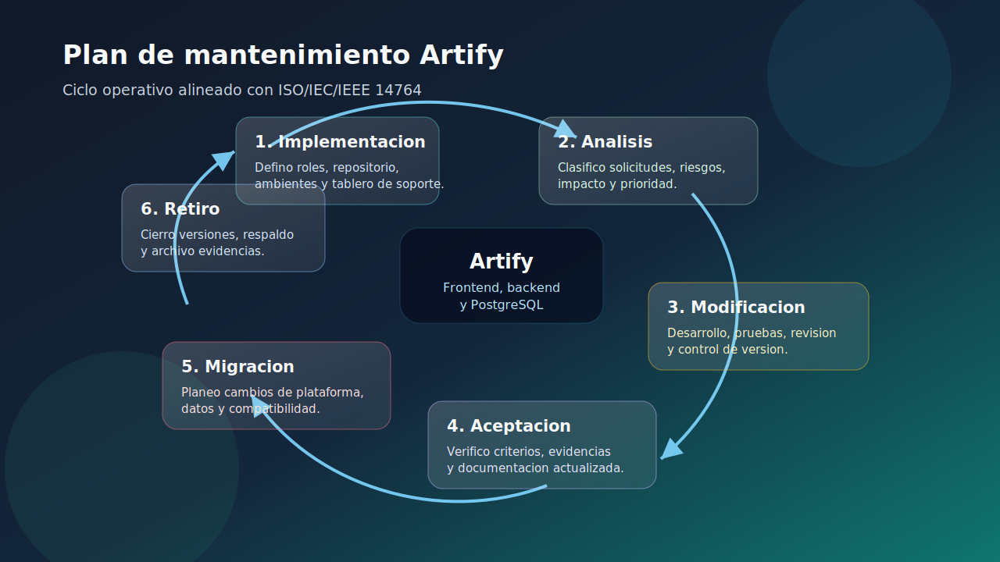
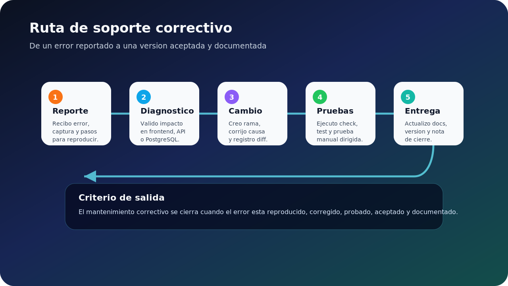
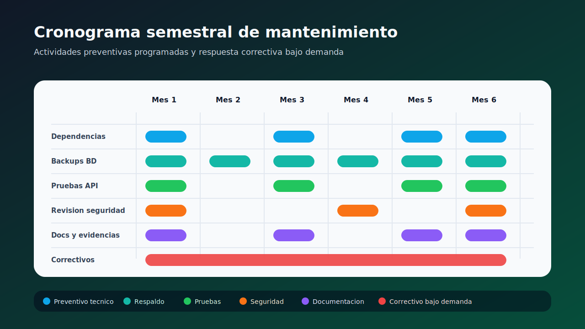

# Plan de mantenimiento y soporte del software Artify SENA PostgreSQL

**Evidencia de desempeño:** Diseñar plan de mantenimiento y soporte del software. GA10-220501097-AA8-EV01  
**Proyecto formativo:** Artify SENA PostgreSQL - Editor de Imágenes Web  
**Aprendiz:** Iván Darío Madrid Daza  
**Programa:** Análisis y Desarrollo de Software - SENA  
**Fecha:** Julio de 2026  

## Resumen

En este documento presento el plan de mantenimiento y soporte para Artify SENA PostgreSQL, una aplicación web full stack para edición básica de imágenes. El plan se basa en la norma ISO/IEC/IEEE 14764, que define el mantenimiento como un proceso del ciclo de vida del software e incluye actividades como implementación del proceso, análisis de problemas, modificación, aceptación, migración y retiro (Organización Internacional de Normalización [ISO], 2022).

Mi propósito es definir cómo voy a conservar Artify funcional, seguro, documentado y preparado para futuras mejoras. Para lograrlo separo el trabajo en mantenimiento preventivo y correctivo. El mantenimiento preventivo busca evitar fallos antes de que afecten al usuario; el correctivo se aplica cuando ya existe un error o comportamiento inesperado.

**Palabras clave:** mantenimiento de software, soporte técnico, ISO 14764, mantenimiento preventivo, mantenimiento correctivo, Artify.

## Descripción del sistema

Artify SENA PostgreSQL es una solución web que permite editar imágenes desde el navegador. El usuario puede registrarse, iniciar sesión, cargar una imagen, aplicar operaciones básicas y descargar el resultado. El proyecto también cuenta con panel administrativo, registro de sesiones, operaciones de edición y endpoints de analíticas.

El sistema se organiza en tres capas:

| Capa | Tecnología | Responsabilidad |
| --- | --- | --- |
| Frontend | HTML5, CSS3, JavaScript Vanilla y Canvas API | Presentar la interfaz, editar imágenes y consumir la API. |
| Backend | Node.js, Express y `pg` | Gestionar autenticación, sesiones, operaciones, administración y analíticas. |
| Base de datos | PostgreSQL | Guardar usuarios, configuraciones, imágenes, sesiones y operaciones. |

Los módulos que debo mantener son:

- **Autenticación:** registro, login, token firmado y control de rol.
- **Editor:** carga de imágenes, recorte, redimensionamiento, rotación, filtros, zoom y descarga.
- **Administración:** CRUD de usuarios y estadísticas básicas.
- **Actividad:** sesiones de edición, operaciones e imágenes procesadas.
- **Documentación:** archivos técnicos y evidencias del proyecto.

Como Artify maneja datos de usuarios y autenticación, el mantenimiento también debe incluir controles de seguridad. Por eso considero la revisión de dependencias, CORS, tokens, contraseñas protegidas y rutas privadas, tomando como apoyo criterios generales de seguridad web como OWASP Top 10 (OWASP Foundation, 2021).

## Enfoque del mantenimiento preventivo y correctivo

Este plan aplica a la variante `artify-sena-postgresql`. No busca cambiar la arquitectura ni agregar tecnologías nuevas, sino cuidar lo que ya existe: frontend vanilla, backend Express, PostgreSQL, pruebas y documentación.

### Mantenimiento preventivo

El mantenimiento preventivo lo realizo de forma programada para reducir riesgos y evitar fallos. En Artify se enfoca en código, dependencias, base de datos, seguridad, pruebas y documentación.

| Actividad preventiva | Frecuencia | Evidencia |
| --- | --- | --- |
| Ejecutar `pnpm run check` en backend | Antes de entregar cambios | Salida sin errores de sintaxis. |
| Ejecutar `pnpm test` | Mensual o antes de cambios importantes | Resultado de pruebas automatizadas. |
| Revisar dependencias Node.js | Mensual | Registro de versiones o alertas. |
| Verificar login, editor y panel admin | Mensual | Lista de chequeo funcional. |
| Revisar `schema.sql`, `seed.sql` y respaldos | Trimestral o antes de migrar | Confirmación de estructura y respaldo. |
| Actualizar documentación técnica | Cada cambio relevante | Markdown actualizado. |

### Mantenimiento correctivo

El mantenimiento correctivo lo aplico cuando aparece un error. Puede ser un fallo visual, una ruta API incorrecta, una consulta SQL defectuosa, una prueba rota o un problema de autenticación.

| Etapa | Acción principal |
| --- | --- |
| Registro | Describo el problema, fecha, módulo afectado y pasos para reproducir. |
| Diagnóstico | Identifico si el origen está en frontend, backend, base de datos, entorno o documentación. |
| Priorización | Clasifico el impacto como crítico, alto, medio o bajo. |
| Corrección | Implemento el cambio mínimo necesario. |
| Pruebas | Ejecuto pruebas automatizadas y revisión manual cuando aplique. |
| Cierre | Documento causa, solución y resultado. |

## Proceso de implementación

Para implementar el mantenimiento sigo un proceso ordenado, inspirado en ISO/IEC/IEEE 14764. La idea es que cada cambio tenga una causa, una evaluación, una solución y una aceptación, no solo una modificación rápida en el código.

| Elemento | Aplicación en Artify |
| --- | --- |
| Responsable | Yo asumo el análisis, implementación, pruebas y documentación. |
| Entradas | Reportes de error, resultados de pruebas, alertas de seguridad, cambios de entorno o necesidades académicas. |
| Herramientas | Git, GitHub, pnpm, Node Test Runner, PostgreSQL, README y documentos técnicos. |
| Salidas | Cambio implementado, pruebas ejecutadas, evidencia, documentación actualizada y nota de cierre. |

El flujo general que seguiré es:

1. Recibo o identifico la necesidad de mantenimiento.
2. Reproduzco el problema o justifico la actividad preventiva.
3. Analizo el impacto sobre frontend, backend, base de datos y documentación.
4. Implemento el cambio de forma controlada.
5. Ejecuto las pruebas correspondientes.
6. Actualizo documentación si el comportamiento cambia.
7. Reviso el resultado y cierro la actividad.

Las solicitudes de cambio o pull requests permiten revisar modificaciones antes de integrarlas, lo cual ayuda a mantener trazabilidad y control de versiones (GitHub, 2026a).

## Análisis de modificación y problemas

Antes de modificar Artify debo entender qué ocurre y qué tanto afecta al sistema. Esto evita cambios innecesarios y ayuda a priorizar.

| Tipo de situación | Ejemplo en Artify | Tratamiento |
| --- | --- | --- |
| Error funcional | El login no redirige al editor. | Correctivo |
| Error visual | El panel admin se desborda en una pantalla pequeña. | Correctivo |
| Error de datos | Una operación no se registra en PostgreSQL. | Correctivo |
| Riesgo de seguridad | Dependencia vulnerable o CORS mal configurado. | Preventivo o correctivo |
| Mejora de pruebas | Agregar pruebas para rutas protegidas. | Preventivo |
| Documentación desactualizada | README no refleja una ruta nueva. | Preventivo |
| Migración | Cambiar proveedor o versión de PostgreSQL. | Planificado |

La prioridad se define así:

| Prioridad | Criterio | Tiempo objetivo |
| --- | --- | --- |
| Crítica | Impide login, edición o expone datos sensibles. | Mismo día |
| Alta | Afecta una función principal con alternativa temporal. | 1 a 2 días |
| Media | Afecta una función secundaria o documentación importante. | 3 a 5 días |
| Baja | Ajuste menor o mejora sin impacto directo. | Próximo ciclo preventivo |

En cada análisis reviso archivos afectados, rutas API, tablas PostgreSQL, pruebas disponibles, seguridad, despliegue y documentación. Por ejemplo, si modifico `/api/login`, también debo validar `login.js`, redirección por rol, token, respuesta del backend y pruebas de autenticación.

## Implementación de la modificación

Cuando el análisis está claro, implemento la modificación con alcance controlado. En Artify debo respetar la arquitectura actual: frontend HTML/CSS/JavaScript Vanilla, backend Node.js + Express y PostgreSQL con `pg`.

Las reglas principales son:

- No cambiar contratos API sin revisar frontend y pruebas.
- Validar datos en backend, aunque el frontend también valide.
- No subir archivos `.env` reales ni secretos.
- Mantener las tablas y columnas PostgreSQL usadas por el proyecto.
- Actualizar documentación cuando cambie instalación, despliegue, rutas o comportamiento.
- Revisar seguridad en autenticación, tokens, roles, CORS y mensajes de error.

Las pruebas mínimas dependen del tipo de cambio:

| Cambio | Validación |
| --- | --- |
| Backend | `cd backend && pnpm run check` |
| Autenticación o rutas protegidas | `cd backend && pnpm test` |
| Base de datos | Revisión de `schema.sql`, `seed.sql` y consultas afectadas |
| Frontend | Prueba manual de login, editor o admin |
| Despliegue | Verificación de `/health` y consumo real de API |

Para reducir riesgos de seguridad, también revisaré alertas de dependencias. GitHub permite automatizar y revisar actualizaciones de seguridad con Dependabot, lo cual ayuda a mantener el proyecto con menor exposición a vulnerabilidades conocidas (GitHub, 2026b).

## Aceptación y revisión del mantenimiento

Un mantenimiento queda aceptado cuando el problema fue resuelto o la actividad preventiva fue completada, sin romper otras partes del sistema. No basta con cambiar el archivo; debo comprobar que Artify sigue funcionando.

| Criterio | Verificación |
| --- | --- |
| Funcionalidad | La función corregida opera como se espera. |
| No regresión | No se rompen login, editor, admin, API ni base de datos. |
| Pruebas | Se ejecutan las validaciones aplicables. |
| Seguridad | No se agregan secretos ni se debilitan rutas protegidas. |
| Documentación | Se actualiza README, CONTEXT o docs cuando corresponde. |
| Trazabilidad | Queda claro qué se cambió, por qué y con qué resultado. |

Después de un cambio importante hago una revisión breve: identifico la causa principal, evalúo si se pudo prevenir y decido si hace falta agregar pruebas o mejorar documentación. Esta revisión permite que el mantenimiento no sea solo reacción, sino aprendizaje para el siguiente ciclo.

## Migración

La migración consiste en mover Artify de una versión, entorno o tecnología hacia otra sin perder datos ni trazabilidad. En este proyecto puede aplicar a base de datos, backend, frontend, documentación o versiones de herramientas.

Ejemplos posibles:

- Pasar PostgreSQL local a Neon.
- Cambiar el backend a otro proveedor.
- Actualizar Node.js, Express o PostgreSQL.
- Cambiar la URL pública del backend en Netlify.
- Reorganizar documentos o evidencias.

Cuando realice una migración seguiré estos pasos:

1. Identifico el motivo y alcance de la migración.
2. Hago respaldo de la base de datos si hay datos útiles.
3. Documento el estado inicial.
4. Preparo el nuevo entorno.
5. Cargo esquema, datos y variables de entorno.
6. Pruebo `/health`, login, editor y panel admin.
7. Comparo resultados antes y después.
8. Documento el cambio y el resultado.

Los principales riesgos son pérdida de datos, variables mal configuradas, errores de CORS, incompatibilidad de versiones y caída temporal del servicio. Como el editor depende de Canvas API, también debo verificar compatibilidad del navegador después de cambios relevantes en frontend (MDN Web Docs, 2026).

## Retiro

El retiro ocurre cuando una versión, módulo, archivo o configuración deja de usarse. No significa borrar sin control, sino cerrar de forma ordenada.

En Artify puedo retirar:

- Versiones antiguas del backend.
- Scripts SQL reemplazados.
- Documentos obsoletos.
- Configuraciones de despliegue que ya no se usan.
- Recursos visuales o ramas de Git que ya fueron integradas.

El proceso de retiro será:

1. Confirmo que el elemento ya no se usa.
2. Reviso referencias internas.
3. Hago respaldo si contiene información útil.
4. Actualizo documentación e índices.
5. Archivo o elimino el elemento.
6. Verifico que el proyecto siga funcionando.
7. Registro la decisión.

Retirar componentes innecesarios ayuda a evitar confusión, duplicidad y riesgos por archivos antiguos que ya no representan el estado real del proyecto.

## Cronograma de mantenimiento

El siguiente cronograma organiza las actividades preventivas durante seis meses. El mantenimiento correctivo queda disponible bajo demanda, según los errores o incidentes que aparezcan.

| Actividad | Mes 1 | Mes 2 | Mes 3 | Mes 4 | Mes 5 | Mes 6 |
| --- | --- | --- | --- | --- | --- | --- |
| Revisar dependencias backend | X |  | X |  | X | X |
| Respaldar base de datos | X | X | X | X | X | X |
| Ejecutar pruebas API | X |  | X |  | X | X |
| Revisar seguridad y CORS | X |  |  | X |  | X |
| Actualizar documentación | X |  | X |  | X | X |
| Verificar frontend manualmente | X | X | X | X | X | X |
| Revisar despliegue y `/health` | X | X | X | X | X | X |
| Atender correctivos | Según reporte | Según reporte | Según reporte | Según reporte | Según reporte | Según reporte |

Para controlar el seguimiento usaré indicadores sencillos: pruebas exitosas antes de entregar cambios importantes, cero incidentes críticos abiertos, documentación actualizada al cierre de cada ciclo, respaldo mensual como mínimo y cero secretos publicados en el repositorio.

## Conclusiones

Este plan me permite mantener Artify SENA PostgreSQL de forma ordenada y alineada con ISO/IEC/IEEE 14764. El mantenimiento no se limita a corregir errores; también incluye prevención, análisis, aceptación, migración y retiro.

En mi proyecto, el mantenimiento preventivo es importante porque reduce fallos en autenticación, dependencias, base de datos y documentación. El mantenimiento correctivo me da una ruta clara para atender errores sin improvisar.

Con este documento dejo una guía práctica para cuidar Artify durante su evolución académica y técnica. Cada cambio debe tener causa, análisis, prueba, aceptación y evidencia.

## Referencias

GitHub. (2026a). *Acerca de las solicitudes de incorporación de cambios*. Documentación de GitHub. https://docs.github.com/es/pull-requests/collaborating-with-pull-requests/proposing-changes-to-your-work-with-pull-requests/about-pull-requests

GitHub. (2026b). *Acerca de las actualizaciones de seguridad de Dependabot*. Documentación de GitHub. https://docs.github.com/es/code-security/dependabot/dependabot-security-updates/about-dependabot-security-updates

MDN Web Docs. (2026). *Canvas API*. https://developer.mozilla.org/es/docs/Web/API/Canvas_API

Organización Internacional de Normalización. (2022). *ISO/IEC/IEEE 14764:2022 Ingeniería de software - Procesos del ciclo de vida del software - Mantenimiento*. https://www.iso.org/es/contents/data/standard/08/07/80710.html

OWASP Foundation. (2021). *OWASP Top 10:2021*. https://owasp.org/Top10/es/
