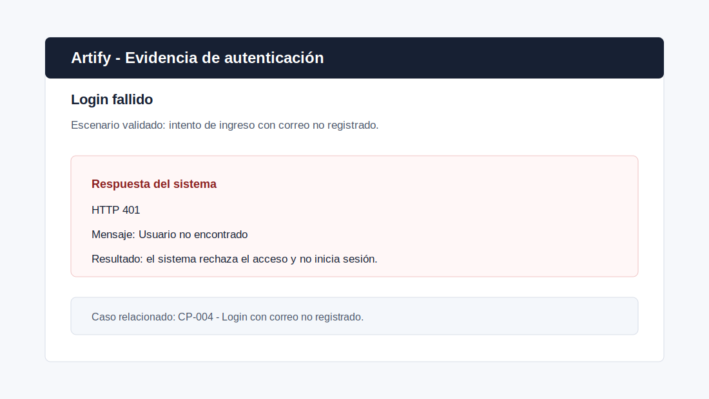
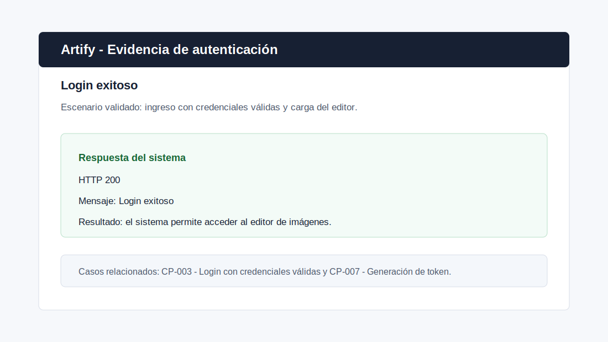
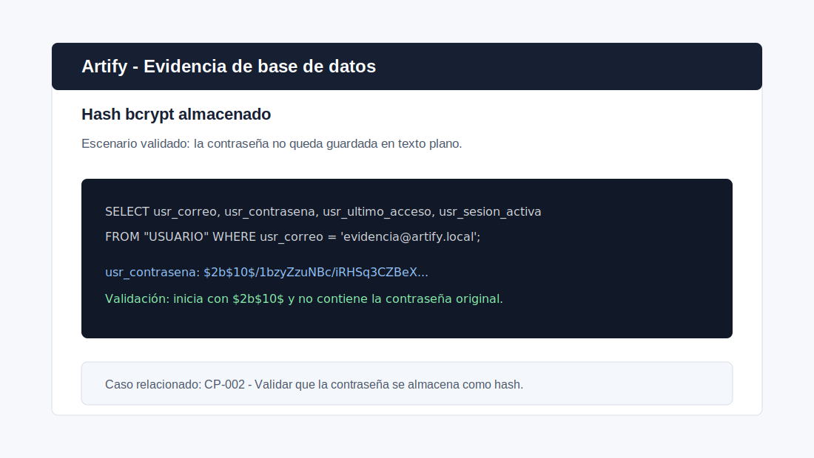
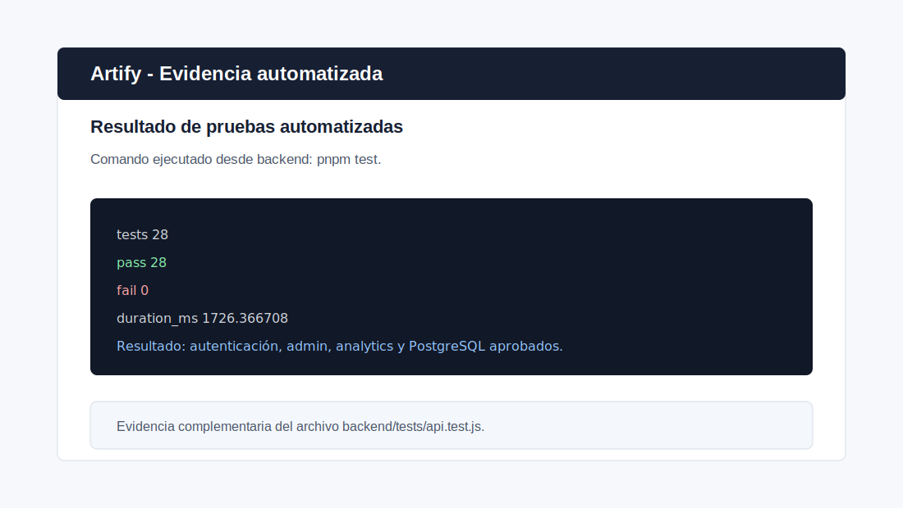

# Plan de Pruebas - Módulo de Autenticación

> **Proyecto:** Artify - Editor de Imágenes Web
> **Módulo evaluado:** Autenticación de usuarios
> **Programa:** Análisis y Desarrollo de Software - SENA
> **Autor:** Iván Darío Madrid Daza
> **Fecha:** Mayo 2026
> **Última actualización:** Julio 2026

---

## 1. Objetivo

En este artefacto defino y ejecuto un plan de pruebas para validar el funcionamiento del módulo de autenticación de Artify. Me enfoco en comprobar el inicio de sesión, el tratamiento de credenciales inválidas, la generación del token de acceso, la protección de rutas mediante middleware y los cambios que se realizan en la base de datos después de un login exitoso.

También verifico que la contraseña del usuario no se almacene en texto plano, sino como un hash no reversible generado mediante `bcrypt`.

---

## 2. Alcance

Este plan de pruebas lo centro exclusivamente en el módulo de autenticación:

- Registro de usuario como paso previo para crear credenciales de prueba.
- Inicio de sesión con credenciales válidas.
- Inicio de sesión con credenciales inválidas.
- Validación del almacenamiento de la contraseña en la base de datos.
- Verificación de actualización de datos de acceso en la tabla `USUARIO`.
- Validación de generación de token después de un login exitoso.
- Rechazo de solicitudes sin token o con un token inválido en rutas protegidas.

No incluyo pruebas funcionales del editor de imágenes, filtros, recorte, panel de administración ni operaciones avanzadas, excepto cuando sirven como evidencia complementaria para demostrar que la autenticación permite acceder correctamente al sistema.

---

## 3. Ambiente de Pruebas

| Elemento | Descripción |
| --- | --- |
| Sistema | Artify |
| Frontend | HTML, CSS, JavaScript Vanilla |
| Backend | Node.js + Express |
| Base de datos | PostgreSQL |
| Tabla principal | `USUARIO` |
| Herramienta de hash de contraseñas | `bcryptjs` |
| Controlador evaluado | `backend/controllers/auth.controller.js` (`registro` y `login`) |
| Middleware evaluado | `backend/middlewares/auth.js` (autenticación y autorización) |
| Utilidad de tokens | `backend/utils/token.js` (creación y verificación) |
| Script de base de datos | `database/postgresql/schema.sql` |

---

## 4. Componentes Evaluados

Para realizar las pruebas reviso el controlador de registro y login, el middleware que protege las rutas, la utilidad que firma y verifica los tokens y la tabla donde se almacenan los usuarios registrados.

### 4.1 Controlador de autenticación

Archivo:

```text
backend/controllers/auth.controller.js
```

Funciones evaluadas:

- `registro(req, res)`
- `login(req, res)`

Estas funciones reciben las solicitudes de registro e inicio de sesión. No contienen los middlewares que protegen las rutas privadas.

### 4.2 Middleware de autenticación y autorización

Archivo:

```text
backend/middlewares/auth.js
```

Funciones evaluadas:

- `autenticarToken(req, res, next)`
- `requiereAdmin(req, res, next)`

`autenticarToken` extrae y verifica el token, comprueba que la cuenta siga activa y carga los datos actuales del usuario en `req.auth`. `requiereAdmin` valida que el rol autenticado sea `admin` antes de permitir una acción administrativa.

### 4.3 Utilidad de tokens

Archivo:

```text
backend/utils/token.js
```

Funciones evaluadas:

- `crearToken(payload)`
- `verificarToken(token)`

El controlador usa `crearToken` después de un login exitoso, mientras que el middleware llama a `verificarToken` cuando una solicitud intenta acceder a una ruta protegida.

### 4.4 Tabla de usuarios

Tabla:

```sql
"USUARIO"
```

Campo donde se almacena la contraseña:

```sql
usr_contrasena varchar(255) NOT NULL
```

---

## 5. Evidencia Técnica del Hash de Contraseña

Al revisar el código del proyecto identifiqué que la contraseña se transforma en un hash durante el registro del usuario, antes de ser almacenada en la base de datos.

Ubicación:

```text
backend/controllers/auth.controller.js
```

Fragmento relevante:

```javascript
const hash = bcrypt.hashSync(password, 10);
```

Luego, el valor que se guarda en la base de datos es `hash`, no la contraseña original escrita por el usuario. El controlador actual ejecuta la inserción dentro de una transacción y obtiene el identificador creado mediante `RETURNING`:

```javascript
const [resultadoUsuario] = await dbPromise.query(
  `INSERT INTO USUARIO (
    usr_nombres, usr_apellidos, usr_cedula,
    usr_fecha_nacimiento, usr_correo, usr_contrasena,
    usr_fecha_registro, usr_estado_usuario
  ) VALUES (?, ?, ?, ?, ?, ?, NOW(), 'activo')
  RETURNING usr_id_usuario`,
  [
    nombresNormalizados,
    apellidosNormalizados,
    cedulaNormalizada,
    fechaNacimiento,
    correoNormalizado,
    hash,
  ]
);
```

Durante el login observé que el sistema no compara texto plano directamente. En su lugar, usa `bcrypt.compareSync` para comparar la contraseña ingresada por el usuario contra el hash almacenado:

```javascript
const passwordValida = bcrypt.compareSync(password, usuario.usr_contrasena);
```

Esto me permite concluir que la contraseña original no se recupera desde la base de datos: bcrypt verifica la credencial calculando y comparando hashes de manera segura.

---

## 6. Casos de Prueba

### CP-001 - Registro de usuario con datos válidos

| Campo | Detalle |
| --- | --- |
| Objetivo | Verificar que el sistema permita crear un usuario válido. |
| Precondición | El correo y la cédula no deben existir previamente en la tabla `USUARIO`. |
| Datos de entrada | Nombres, apellidos, cédula, fecha de nacimiento, correo y contraseña válida. |
| Pasos | Enviar solicitud de registro desde el formulario o API. |
| Resultado esperado | El sistema responde `Registro exitoso` y crea el usuario en la base de datos. |
| Validación en BD | Debe existir un nuevo registro en `USUARIO`. |
| Estado | Aprobado. |

Consulta SQL sugerida:

```sql
SELECT usr_id_usuario, usr_correo, usr_contrasena, usr_fecha_registro
FROM "USUARIO"
WHERE usr_correo = 'correo_prueba@artify.local';
```

---

### CP-002 - Validar que la contraseña se almacena como hash

| Campo | Detalle |
| --- | --- |
| Objetivo | Confirmar que la contraseña no se guarda en texto plano. |
| Precondición | Debe existir un usuario registrado. |
| Datos de entrada | Correo del usuario registrado. |
| Pasos | Consultar el campo `usr_contrasena` en la tabla `USUARIO`. |
| Resultado esperado | El valor almacenado debe ser un hash generado por bcrypt. |
| Validación en BD | El valor debe iniciar normalmente con `$2a$` o `$2b$` y no debe coincidir con la contraseña original. |
| Estado | Aprobado. |

Consulta SQL sugerida:

```sql
SELECT usr_correo, usr_contrasena
FROM "USUARIO"
WHERE usr_correo = 'correo_prueba@artify.local';
```

Ejemplo de resultado esperado:

```text
$2b$10$...
```

Interpretación:

- `$2b$` identifica el algoritmo bcrypt.
- `10` representa el factor de costo utilizado en `bcrypt.hashSync(password, 10)`.
- El resto del valor corresponde al hash generado.

---

### CP-003 - Login con credenciales válidas

| Campo | Detalle |
| --- | --- |
| Objetivo | Verificar que un usuario registrado pueda iniciar sesión. |
| Precondición | El usuario debe existir en la tabla `USUARIO`. |
| Datos de entrada | Correo registrado y contraseña correcta. |
| Pasos | Enviar correo y contraseña al endpoint `/api/login`. |
| Resultado esperado | El sistema responde `Login exitoso`, retorna datos del usuario y genera un token. |
| Validación en BD | Se actualiza `usr_ultimo_acceso` y `usr_sesion_activa` cambia a `true`. |
| Estado | Aprobado. |

Consulta SQL sugerida antes y después del login:

```sql
SELECT usr_correo, usr_ultimo_acceso, usr_sesion_activa
FROM "USUARIO"
WHERE usr_correo = 'correo_prueba@artify.local';
```

---

### CP-004 - Login con correo no registrado

| Campo | Detalle |
| --- | --- |
| Objetivo | Verificar que el sistema rechace un correo inexistente. |
| Precondición | El correo no debe existir en la base de datos. |
| Datos de entrada | Correo no registrado y cualquier contraseña válida en formato. |
| Pasos | Enviar solicitud de login. |
| Resultado esperado | El sistema responde `Credenciales incorrectas`. |
| Código esperado | HTTP 401. |
| Validación en BD | No se modifica ningún registro de la tabla `USUARIO`. |
| Estado | Aprobado. |

---

### CP-005 - Login con contraseña incorrecta

| Campo | Detalle |
| --- | --- |
| Objetivo | Verificar que el sistema rechace una contraseña incorrecta. |
| Precondición | El correo debe existir en la base de datos. |
| Datos de entrada | Correo válido y contraseña incorrecta. |
| Pasos | Enviar solicitud de login. |
| Resultado esperado | El sistema responde `Credenciales incorrectas`. |
| Código esperado | HTTP 401. |
| Validación en BD | No debe actualizarse el acceso del usuario como sesión válida. |
| Estado | Aprobado. |

---

### CP-006 - Login con formato de correo inválido

| Campo | Detalle |
| --- | --- |
| Objetivo | Validar que el backend rechace correos con formato incorrecto. |
| Precondición | Ninguna. |
| Datos de entrada | Correo con formato inválido, por ejemplo `correo-invalido`. |
| Pasos | Enviar solicitud de login. |
| Resultado esperado | El sistema responde `Ingresa un correo válido`. |
| Código esperado | HTTP 400. |
| Validación en BD | No se consulta ni modifica un usuario válido. |
| Estado | Aprobado. |

---

### CP-007 - Generación de token en login exitoso

| Campo | Detalle |
| --- | --- |
| Objetivo | Verificar que el backend entregue un token al autenticar correctamente. |
| Precondición | Usuario registrado y activo. |
| Datos de entrada | Correo y contraseña correctos. |
| Pasos | Ejecutar login. |
| Resultado esperado | La respuesta incluye el campo `token`. |
| Validación adicional | El token contiene información firmada del usuario, como `id`, `correo` y `rol`. |
| Estado | Aprobado. |

---

### CP-008 - Acceso a ruta protegida con token inválido

| Campo | Detalle |
| --- | --- |
| Objetivo | Verificar que el backend rechace tokens manipulados o inválidos. |
| Precondición | Debe existir una ruta protegida por autenticación. |
| Datos de entrada | Encabezado `Authorization` con un token inválido. |
| Pasos | Enviar solicitud a una ruta protegida usando un token incorrecto. |
| Resultado esperado | El sistema rechaza la solicitud y no permite acceder al recurso protegido. |
| Código esperado | HTTP 401. |
| Validación adicional | La respuesta debe indicar que el token está ausente, inválido o expirado. |
| Estado | Aprobado. |

---

## 7. Validaciones Directas en Base de Datos

### 7.1 Consultar usuario registrado

```sql
SELECT usr_id_usuario, usr_nombres, usr_correo, usr_fecha_registro
FROM "USUARIO"
WHERE usr_correo = 'correo_prueba@artify.local';
```

### 7.2 Verificar hash de contraseña

```sql
SELECT usr_correo, usr_contrasena
FROM "USUARIO"
WHERE usr_correo = 'correo_prueba@artify.local';
```

Resultado esperado:

```text
La columna usr_contrasena no debe contener la contraseña escrita por el usuario.
Debe contener un hash bcrypt similar a: $2b$10$...
```

### 7.3 Verificar cambios después del login

```sql
SELECT usr_correo, usr_ultimo_acceso, usr_sesion_activa
FROM "USUARIO"
WHERE usr_correo = 'correo_prueba@artify.local';
```

Resultado esperado después de login exitoso:

```text
usr_ultimo_acceso: fecha y hora actualizada
usr_sesion_activa: true
```

---

## 8. Evidencias Visuales del Proceso

Como complemento del plan de pruebas, agrego representaciones visuales sanitizadas de los escenarios principales: rechazo de acceso, login exitoso, almacenamiento de la contraseña como hash bcrypt y resultado de pruebas automatizadas. Los SVG omiten credenciales y datos sensibles, y sirven para explicar los resultados de forma legible; no deben interpretarse como capturas primarias ni sustituyen una ejecución verificable.

La verificación reproducible se respalda con la suite `backend/tests/api.test.js` y con el workflow de integración continua `.github/workflows/backend-tests.yml`.

### 8.1 Login fallido

Representación sanitizada del rechazo de credenciales inválidas:



### 8.2 Login exitoso

Representación sanitizada del acceso correcto al editor:



### 8.3 Hash bcrypt en base de datos

Salida sanitizada que oculta el valor completo del hash y los datos del usuario:



### 8.4 Resultado de pruebas automatizadas

Representación resumida del resultado; la ejecución reproducible corresponde a la suite y al workflow indicados anteriormente:



---

## 9. Evidencia Automatizada Complementaria

Como apoyo al plan de pruebas manual, también agregué una prueba automatizada de integración en:

```text
backend/tests/api.test.js
```

Esta suite también se ejecuta en GitHub Actions mediante:

```text
.github/workflows/backend-tests.yml
```

Actualmente ejecuto 19 pruebas automatizadas que cubren las siguientes validaciones:

- Disponibilidad del proceso Express y de PostgreSQL mediante `/health` y `/ready`.
- Respuesta del endpoint público de analíticas.
- Rechazo de login con correo inválido.
- Rechazo de login con correo no registrado.
- Rechazo de fechas de nacimiento inexistentes.
- Registro de usuario temporal.
- Normalización de nombres y correo.
- Verificación en PostgreSQL de que la contraseña se guarda como hash bcrypt.
- Login exitoso.
- Generación de token.
- Validación de `TOKEN_SECRET` según el entorno antes de iniciar el backend.
- Actualización de `usr_ultimo_acceso` y `usr_sesion_activa` después del login.
- Validación de preferencias, registro de descarga y analytics resultante.
- Acceso a rutas protegidas con token.
- Rechazo de login con contraseña incorrecta.
- Confirmación de que logins correctos no consumen el límite de fallos.
- Consistencia del indicador cuando existen sesiones simultáneas.
- Rechazo de rutas protegidas sin token.
- Rechazo de rutas protegidas con token inválido.
- Rechazo de rutas protegidas con token expirado.
- Rechazo de acceso a recursos de otro usuario.
- Rechazo de identificadores malformados en rutas protegidas.
- Autenticación de administrador.
- Rechazo de login y revocación del token de una cuenta suspendida.
- Limpieza del usuario temporal en la base de datos.
- Cierre ordenado del servidor HTTP y del pool PostgreSQL al terminar la suite.

Antes de ejecutar la suite creo una base local exclusiva cuyo nombre termine en
`_test` y cargo allí el esquema y los datos iniciales:

```bash
createdb -h localhost -U postgres artify_test
psql -h localhost -U postgres -d artify_test -f database/postgresql/schema.sql
psql -h localhost -U postgres -d artify_test -f database/postgresql/seed.sql
```

Si la base ya existe, no repito `createdb`. Ejecuto las pruebas con una
confirmación explícita de las mutaciones temporales.

**Windows - PowerShell:**

```powershell
cd backend
$env:NODE_ENV = 'test'
$env:DB_NAME = 'artify_test'
$env:ALLOW_TEST_DB_MUTATIONS = 'true'
pnpm test
Remove-Item Env:NODE_ENV
Remove-Item Env:DB_NAME
Remove-Item Env:ALLOW_TEST_DB_MUTATIONS
```

**macOS o Linux:**

```bash
cd backend
NODE_ENV=test DB_NAME=artify_test ALLOW_TEST_DB_MUTATIONS=true pnpm test
```

> **Protección activa:** la suite se detiene antes de conectarse si `NODE_ENV`
> no es `test`, falta la confirmación, el nombre de la base no termina en
> `_test` o el host es remoto. Una base remota exclusiva exige además
> `ALLOW_REMOTE_TEST_DATABASE=true`; nunca uso esta excepción con Neon o
> producción.

Resultado esperado y verificado por la suite automatizada y el workflow de CI:

```text
19 pruebas ejecutadas
19 pruebas aprobadas
0 pruebas fallidas
```

Con esta evidencia automatizada complemento las pruebas manuales y confirmo que el proyecto valida tanto los flujos correctos como varios escenarios de error comunes en autenticación.

---

## 10. Criterios de Aceptación

Considero aprobado el módulo de autenticación si cumple con los siguientes criterios:

- El usuario puede iniciar sesión con credenciales válidas.
- El sistema rechaza credenciales inválidas.
- El sistema valida el formato del correo antes de autenticar.
- La contraseña se almacena como hash bcrypt y no en texto plano.
- El login exitoso actualiza `usr_ultimo_acceso` y `usr_sesion_activa`.
- El backend genera un token para el usuario autenticado.
- Las rutas protegidas rechazan solicitudes sin token.
- Las rutas protegidas rechazan solicitudes con token inválido.
- Las pruebas automatizadas de integración se ejecutan correctamente.

---

## 11. Conclusiones

Después de realizar este plan de pruebas, concluyo que el módulo de autenticación de Artify cumple con los criterios básicos de seguridad esperados para el proyecto. La contraseña del usuario se transforma en un hash bcrypt antes de almacenarse, y durante el login se verifica la contraseña ingresada contra el hash almacenado.

Las pruebas realizadas me permitieron confirmar que el sistema diferencia entre credenciales válidas, credenciales inválidas y formatos de correo inválidos, sin exponer si el correo existe o si falló únicamente la contraseña. Además, verifiqué que un login exitoso genera un token de autenticación y actualiza información de acceso en la tabla `USUARIO`.

También confirmé mediante pruebas automatizadas que el hash almacenado no coincide con la contraseña original y que las rutas protegidas rechazan solicitudes sin token o con un token inválido. Esto fortalece la evidencia del comportamiento esperado del módulo de autenticación.

Como mejora futura, considero importante mantener las pruebas automatizadas y ampliarlas progresivamente para cubrir recuperación de contraseña, variaciones del límite de intentos fallidos y más escenarios de expiración de tokens.
