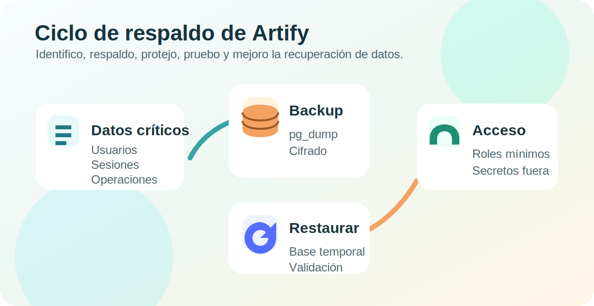
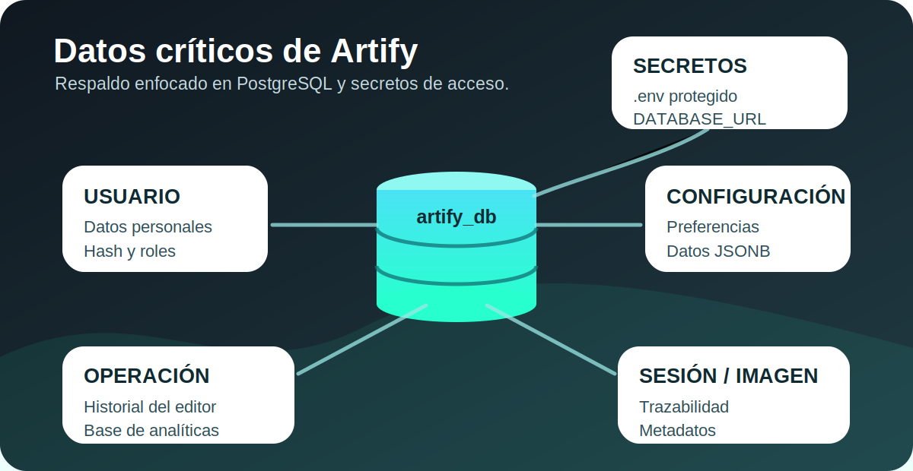
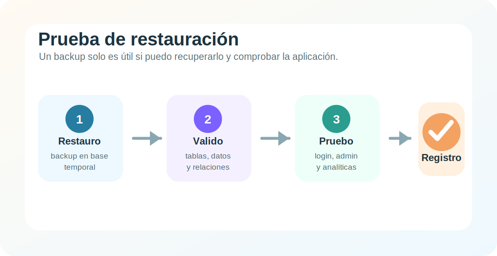

# Plan de migracion y respaldo de datos de Artify con referencia en ISO 27001

> **Evidencia:** GA10-220501097-AA9 - Documentar el proceso de migracion y respaldo de los datos  
> **Producto:** Documentacion de plan de migracion y respaldo de los datos del software  
> **Proyecto formativo:** Artify  
> **Aprendiz:** Ivan Dario Madrid Daza  
> **Programa:** Analisis y Desarrollo de Software - SENA  
> **Fecha:** Julio de 2026

---

## Introduccion

En esta evidencia documento el plan que aplicaria para proteger los datos de Artify mediante copias de respaldo, pruebas de restauracion y controles de acceso. Tomo como referencia la norma ISO/IEC 27001 porque esta orienta la gestion de la seguridad de la informacion mediante identificacion de riesgos, controles, responsabilidades, informacion documentada y mejora continua (ISO/IEC, 2022).

Artify es una aplicacion web de edicion de imagenes con frontend HTML, CSS y JavaScript, backend Node.js con Express y base de datos PostgreSQL. En esta version, PostgreSQL es el motor oficial de persistencia. Por eso, el plan se centra especialmente en la base `artify_db`, sus tablas principales, los scripts SQL, las variables de entorno y la documentacion tecnica del proyecto.



## Objetivo

Mi objetivo es definir un plan claro y aplicable para que la informacion critica de Artify pueda recuperarse ante errores humanos, fallos tecnicos, corrupcion de datos, cambios mal ejecutados o incidentes de seguridad.

Con este plan busco cuidar tres principios basicos de seguridad de la informacion:

- **Confidencialidad:** que los respaldos solo sean consultados por personas autorizadas.
- **Integridad:** que los respaldos no sean alterados sin control.
- **Disponibilidad:** que Artify pueda recuperarse en un tiempo razonable si ocurre un incidente.

## Alcance del plan

Este plan cubre los datos y recursos que permiten reconstruir o recuperar Artify:

| Recurso | Incluido en el plan | Motivo |
| --- | --- | --- |
| Base PostgreSQL `artify_db` | Si | Contiene usuarios, configuraciones, sesiones, operaciones y metadatos de imagenes. |
| `database/postgresql/schema.sql` | Si | Permite reconstruir la estructura de la base. |
| `database/postgresql/seed.sql` | Si | Permite cargar datos minimos de verificacion. |
| `.env` y variables de entorno | Si, con manejo restringido | Contienen credenciales y secretos; no deben subirse al repositorio. |
| Codigo fuente en GitHub | Si | Permite recuperar backend, frontend, scripts y documentacion. |
| Imagenes editadas por usuarios | Parcial | Artify registra metadatos; los archivos finales se descargan en el equipo del usuario. |
| Documentacion tecnica | Si | Explica instalacion, despliegue, migracion y estructura de datos. |

## Identificacion de datos criticos

Para decidir que debo respaldar primero, clasifico los datos segun su valor para el funcionamiento del sistema y el impacto que tendria perderlos.



| Dato critico | Ubicacion | Nivel | Justificacion |
| --- | --- | --- | --- |
| Usuarios registrados | Tabla `USUARIO` | Alto | Contiene datos personales, correo, rol, estado y hash de contrasena. |
| Credenciales y secretos | `.env`, `DATABASE_URL`, `TOKEN_SECRET` | Alto | Permiten conectar la base y firmar tokens; si se filtran, comprometen el sistema. |
| Configuracion de usuario | Tabla `CONFIGURACION` | Medio | Guarda preferencias que personalizan la experiencia del editor. |
| Sesiones de edicion | Tabla `SESION_EDICION` | Medio | Permiten trazabilidad del uso del editor. |
| Operaciones del editor | Tabla `OPERACION` | Alto | Soportan historial, estadisticas y analiticas. |
| Metadatos de imagenes | Tabla `IMAGEN` | Medio | Registran informacion de imagenes procesadas, formato y tamano. |
| Scripts SQL | `database/postgresql/` | Alto | Permiten reconstruir la base y validar migraciones. |
| Codigo fuente | Repositorio GitHub | Alto | Permite recuperar la aplicacion completa. |

En Artify considero mas criticos los datos de `USUARIO`, los secretos de entorno y las operaciones del editor, porque estan relacionados con autenticacion, autorizacion, trazabilidad y funcionamiento del backend.

## Politicas de copia de seguridad

Defino estas politicas para que las copias no dependan de la memoria o de acciones improvisadas. La norma ISO 27001 exige que la organizacion planifique controles de acuerdo con sus riesgos; por eso, en Artify convierto el respaldo en una rutina documentada y verificable.

### Frecuencia

| Tipo de respaldo | Frecuencia | Contenido | Responsable |
| --- | --- | --- | --- |
| Respaldo diario | Cada dia al finalizar la jornada | Base `artify_db` | Administrador tecnico |
| Respaldo semanal completo | Cada domingo | Base, scripts SQL y documentacion | Administrador tecnico |
| Respaldo antes de cambios | Antes de migraciones, despliegues o cambios de esquema | Base actual y scripts | Desarrollador responsable |
| Respaldo mensual de conservacion | Una vez al mes | Copia completa verificada | Responsable del proyecto |

### Metodo

Para PostgreSQL usaria `pg_dump` porque permite exportar la base en un archivo reutilizable. El comando de referencia seria:

```bash
pg_dump "$DATABASE_URL" \
  --format=custom \
  --file="backups/artify_db_$(date +%Y-%m-%d).backup"
```

Para una copia SQL legible, util para revision academica o diagnostico, podria usar:

```bash
pg_dump "$DATABASE_URL" \
  --format=plain \
  --file="backups/artify_db_$(date +%Y-%m-%d).sql"
```

### Ubicaciones de almacenamiento

Aplicaria una regla sencilla inspirada en la practica 3-2-1:

| Copia | Ubicacion | Proteccion |
| --- | --- | --- |
| Copia principal | Almacenamiento privado del administrador | Carpeta no sincronizada publicamente. |
| Copia secundaria | Unidad externa o almacenamiento privado en la nube | Cifrado y acceso restringido. |
| Copia de emergencia | Proveedor de base de datos o exportacion mensual | Separada del equipo local. |

No guardaria respaldos reales dentro del repositorio publico, porque podrian contener datos personales o hashes de contrasena. En el repositorio solo conservaria scripts, plantillas, documentacion y ejemplos sin datos sensibles.

### Retencion

| Tipo | Tiempo de conservacion |
| --- | --- |
| Diarios | 7 dias |
| Semanales | 4 semanas |
| Mensuales | 3 meses |
| Antes de migracion importante | Hasta validar que el cambio quedo estable |

### Proteccion del archivo de respaldo

Cada backup debe quedar comprimido o cifrado cuando salga del entorno local. Para nombrarlo usaria una convencion estable:

```text
artify_db_YYYY-MM-DD_tipo_entorno.backup
```

Ejemplo:

```text
artify_db_2026-07-08_completo_produccion.backup
```

## Pruebas de restauracion

No me basta con generar copias; tambien debo comprobar que se puedan restaurar. Una copia que nunca se prueba puede dar una falsa sensacion de seguridad.



### Frecuencia de pruebas

| Prueba | Frecuencia | Resultado esperado |
| --- | --- | --- |
| Restauracion tecnica | Mensual | El backup carga en una base temporal sin errores. |
| Validacion funcional | Mensual | Login, registro, admin y analytics responden correctamente. |
| Prueba antes de migracion | Antes de cambios de esquema | Se confirma que existe punto de regreso. |
| Registro de evidencia | En cada prueba | Fecha, archivo usado, responsable y resultado. |

### Procedimiento de restauracion

Primero crearia una base temporal:

```bash
createdb artify_restore_test
```

Luego restauraria el backup:

```bash
pg_restore \
  --dbname=artify_restore_test \
  --clean \
  --if-exists \
  "backups/artify_db_2026-07-08_completo_produccion.backup"
```

Si el respaldo esta en formato SQL plano:

```bash
psql -d artify_restore_test -f backups/artify_db_2026-07-08_completo_produccion.sql
```

Despues validaria los objetos principales:

```sql
\dt
\dv
SELECT COUNT(*) FROM "USUARIO";
SELECT COUNT(*) FROM "OPERACION";
SELECT COUNT(*) FROM "SESION_EDICION";
```

Finalmente probaria el backend apuntando temporalmente a la base restaurada y revisaria:

- `GET /health`
- login de usuario registrado
- acceso de administrador
- consulta de usuarios del panel admin
- consulta de analytics
- registro de una sesion y una operacion de prueba

## Control de acceso

Para proteger los respaldos, limito el acceso a las personas y procesos que realmente lo necesitan.

| Rol | Acceso permitido | Restriccion |
| --- | --- | --- |
| Administrador tecnico | Crear, restaurar y eliminar backups vencidos | Debe usar credenciales privadas y no compartir dumps sin cifrar. |
| Desarrollador del proyecto | Solicitar respaldo antes de cambios importantes | No debe conservar datos reales innecesarios. |
| Evaluador academico | Revisar documentacion y evidencias | No recibe bases reales ni secretos. |
| Usuario final | Sin acceso a respaldos | Solo accede a sus funciones dentro de Artify. |

Las credenciales de base de datos, `DATABASE_URL`, `TOKEN_SECRET` y archivos `.env` se mantienen fuera del repositorio. Si debo compartir evidencia academica, uso capturas, tablas anonimizadas o datos de prueba.

Tambien aplicaria estas reglas:

- Usar contrasenas fuertes para cuentas de base de datos y proveedores.
- Activar doble factor de autenticacion cuando el proveedor lo permita.
- No enviar backups reales por correo o mensajeria sin cifrado.
- Eliminar respaldos vencidos de forma controlada.
- Registrar quien genero, movio o restauro un backup.

## Gestion del riesgo

Integro las copias de respaldo al proceso de riesgos porque ISO 27001 no trata la seguridad como una accion aislada. El respaldo es un control para reducir impactos sobre disponibilidad, integridad y confidencialidad.

| Riesgo | Impacto | Probabilidad | Control propuesto |
| --- | --- | --- | --- |
| Eliminacion accidental de usuarios o sesiones | Alto | Media | Backup diario y restauracion mensual probada. |
| Error durante una migracion SQL | Alto | Media | Backup previo obligatorio y base temporal de ensayo. |
| Filtracion de un archivo `.backup` | Alto | Baja | Cifrado, acceso minimo y no subir dumps a GitHub. |
| Corrupcion de datos en produccion | Alto | Baja | Retencion por fechas y validacion con consultas. |
| Indisponibilidad del proveedor de base de datos | Medio | Baja | Copia externa mensual y documentacion de restauracion. |
| Perdida del archivo `.env` local | Medio | Media | Gestor seguro de secretos y plantilla `.env.example` sin credenciales reales. |

Cuando un riesgo tenga impacto alto, no lo acepto sin control. Primero defino respaldo, responsable, frecuencia, prueba de restauracion y evidencia.

## Integracion con el proceso de migracion

Artify ya fue migrado a PostgreSQL. Para futuras migraciones, aplicaria este orden:

1. Hago backup completo de `artify_db`.
2. Verifico que el backup exista y tenga tamano coherente.
3. Restauro el backup en una base temporal.
4. Ejecuto los cambios SQL en la base temporal.
5. Pruebo backend, login, admin, sesiones y analytics.
6. Si todo funciona, aplico el cambio al entorno real.
7. Documento fecha, cambio realizado, respaldo usado y resultado.

Con esto evito ejecutar cambios directos sin punto de regreso. En especial, debo tener cuidado con `schema.sql`, porque ese archivo elimina y recrea objetos; por eso solo debe usarse para carga inicial o reinicio controlado con respaldo previo.

## Relacion con ISO 27001

No afirmo que Artify este certificado en ISO 27001. Lo que hago es usar la norma como referencia para ordenar el plan de respaldo.

| Enfoque de ISO 27001 | Aplicacion en Artify |
| --- | --- |
| Gestion de riesgos | Identifico riesgos sobre la base, secretos y datos personales. |
| Control de acceso | Limito quien puede crear, ver y restaurar respaldos. |
| Informacion documentada | Registro politicas, comandos, responsables y pruebas. |
| Continuidad | Defino como recuperar Artify ante perdida o dano de datos. |
| Mejora continua | Reviso el plan despues de pruebas, incidentes o cambios de arquitectura. |

Desde mi punto de vista, el mayor aporte de ISO 27001 para esta evidencia es que me obliga a pensar en el respaldo como un proceso completo: no solo crear una copia, sino protegerla, probarla, controlar su acceso y mejorarla.

## Formato de registro de prueba

Para cada prueba de restauracion usaria una tabla como esta:

| Campo | Registro |
| --- | --- |
| Fecha de prueba | 2026-07-08 |
| Backup usado | `artify_db_2026-07-08_completo_produccion.backup` |
| Base destino | `artify_restore_test` |
| Responsable | Ivan Dario Madrid Daza |
| Resultado tecnico | Restauracion sin errores |
| Resultado funcional | Health, login, admin y analytics revisados |
| Observaciones | Sin novedades |

## Conclusiones

Con este plan dejo definido como protegeria los datos mas importantes de Artify. Identifico como criticos los usuarios, secretos, operaciones, sesiones, configuraciones y scripts SQL porque permiten mantener la aplicacion funcionando y recuperarla si ocurre un incidente.

Tambien concluyo que una copia de seguridad no es suficiente por si sola. Debo probar la restauracion, controlar el acceso, cuidar las credenciales y registrar los resultados. Asi convierto el backup en una practica real de seguridad y no en un archivo olvidado.

Finalmente, este plan complementa la migracion de Artify a PostgreSQL porque agrega una regla importante: antes de tocar datos o estructura de base de datos, debo contar con un respaldo verificable y un procedimiento claro de recuperacion.

## Bibliografia

Asociacion Española de Normalizacion. (2023). *UNE-EN ISO/IEC 27001:2023. Seguridad de la informacion, ciberseguridad y proteccion de la privacidad. Sistemas de gestion de la seguridad de la informacion. Requisitos*. UNE. https://www.une.org/

Instituto Nacional de Ciberseguridad. (s. f.). *Protege tu empresa*. INCIBE. Recuperado el 8 de julio de 2026, de https://www.incibe.es/empresas

International Organization for Standardization. (2022). *ISO/IEC 27001:2022. Sistemas de gestion de la seguridad de la informacion*. ISO. https://www.iso.org/es/norma/27001

Ministerio de Tecnologias de la Informacion y las Comunicaciones. (s. f.). *Modelo de Seguridad y Privacidad de la Informacion*. Gobierno Digital Colombia. Recuperado el 8 de julio de 2026, de https://gobiernodigital.mintic.gov.co/seguridadyprivacidad/

PostgreSQL Global Development Group. (s. f.). *PostgreSQL documentation: pg_dump and pg_restore*. Recuperado el 8 de julio de 2026, de https://www.postgresql.org/docs/
